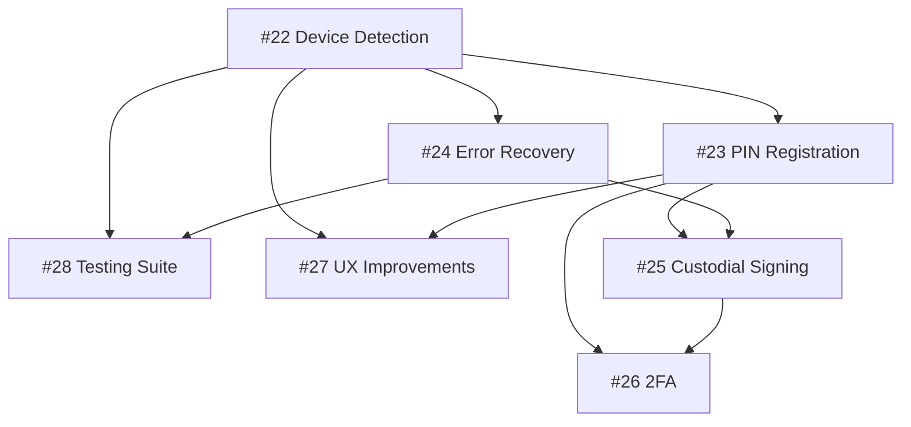

# Exponential Tickets

This directory contains published tickets for the Sozu Wallet project.

## Current Tickets

### Authentication Hardening Epic (SOZU-22 to SOZU-28)

Critical production bug fix and security improvements for authentication system.

**Status**: Published 2026-07-31

| ID | Title | Priority | Status | Estimate |
|----|-------|----------|--------|----------|
| [SOZU-22](./SOZU-22-device-detection.yaml) | Device Detection & Graceful Degradation | 🔴 Critical | Todo | 2-3 days |
| [SOZU-23](./SOZU-23-pin-registration.yaml) | PIN-Based Registration Path | 🟠 High | Todo | 3-4 days |
| [SOZU-24](./SOZU-24-error-recovery.yaml) | Error Recovery & Orphan Cleanup | 🟠 High | Todo | 2 days |
| [SOZU-25](./SOZU-25-custodial-signing.yaml) | Backend Transaction Signing | 🟠 High | Todo | 4-5 days |
| [SOZU-26](./SOZU-26-2fa-integration.yaml) | 2FA Integration for PIN Accounts | 🟡 Medium | Todo | 3 days |
| [SOZU-27](./SOZU-27-ux-improvements.yaml) | UI/UX Improvements | 🟡 Medium | Todo | 2 days |
| [SOZU-28](./SOZU-28-testing-suite.yaml) | Comprehensive Testing Suite | 🟠 High | Todo | 3-4 days |

## Dependency Graph

## Implementation Order

1. **Week 1**: SOZU-22 (Critical bug fix)
2. **Week 2**: SOZU-23, SOZU-24 (PIN beta)
3. **Week 3**: SOZU-25 (Full rollout)
4. **Week 4**: SOZU-26, SOZU-27, SOZU-28 (Polish + testing)

## Related Documentation

- [Authentication Hardening Plan](../../docs/authentication-hardening-plan.md)
- [Test Plan](../../docs/tests/authentication-test-plan.md)
- [Executive Summary](../../AUTH_HARDENING_SUMMARY.md)
