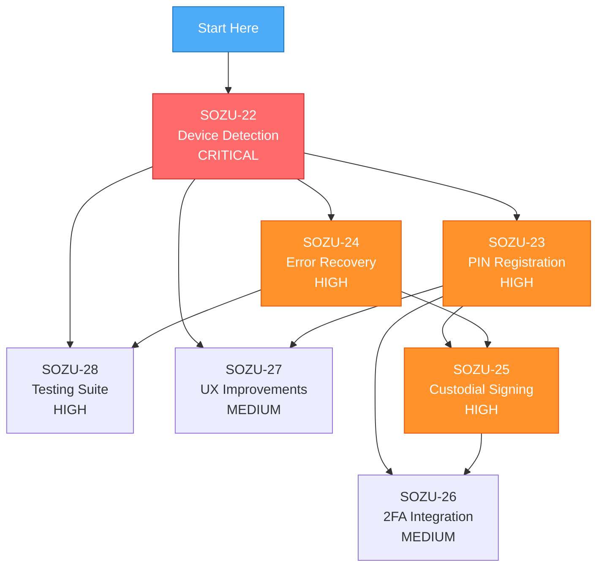

# 🚀 Agent Start Here: Authentication Hardening Implementation

**Status**: Ready for implementation  
**Priority**: CRITICAL (Production bug blocking user registrations)

---

## Quick Start Prompt (Copy & Paste)

```
Implement the authentication hardening tickets starting with SOZU-22.

Context:
- Critical bug: Users without biometric sensors get stuck in passkey flow
- Solution: Dual-path auth (passkey OR PIN with device detection)
- 7 tickets in dependency order, 3-4 weeks total

Start with SOZU-22 (Device Detection - CRITICAL):

Implementation guide: docs/agents/implement-auth-hardening.md
Ticket details: .exponential/tickets/SOZU-22-device-detection.yaml
Full spec: docs/authentication-hardening-plan.md
Test plan: docs/tests/authentication-test-plan.md

Branch from dev, follow git-flow in docs/agents/git-flow.md
Run `bun run build` before pushing.
```

---

## What This Fixes

**Current Bug**: On devices without biometric sensors (older laptops, desktops), users:
1. Enter SozuTag
2. Get prompted to create passkey
3. See "Scan with your phone" (cross-device flow)
4. Browser creates passkey BUT verification never completes
5. User stuck with orphaned passkey credential and no wallet
6. **~15% of users abandoned at registration**

**After Implementation**: Users automatically get:
- **Passkey path** if device has biometrics → Self-custodial
- **PIN path** if device lacks biometrics → Custodial (with 2FA prompts)
- Clean error recovery
- No more orphaned credentials

---

## Implementation Sequence

### Week 1: Critical Fix
**SOZU-22** - Device Detection & Graceful Degradation (CRITICAL)  
→ Stops the bleeding, prevents orphaned credentials

### Week 2: PIN Alternative
**SOZU-23** - PIN-Based Registration Path (HIGH)  
**SOZU-24** - Error Recovery & Orphan Cleanup (HIGH)  
→ Beta launch: PIN path available to 10% of users

### Week 3: Backend Signing
**SOZU-25** - Backend Transaction Signing (HIGH)  
→ Full rollout: Custodial accounts fully functional

### Week 4: Polish
**SOZU-26** - 2FA Integration (MEDIUM)  
**SOZU-27** - UI/UX Improvements (MEDIUM)  
**SOZU-28** - Comprehensive Testing Suite (HIGH)  
→ Production-ready with full test coverage

---

## Key Documents

| Document | Purpose | When to Read |
|----------|---------|--------------|
| **[docs/agents/implement-auth-hardening.md](docs/agents/implement-auth-hardening.md)** | **Full implementation guide** | **First - Start here** |
| [docs/authentication-hardening-plan.md](docs/authentication-hardening-plan.md) | Technical specification | Before each ticket |
| [docs/tests/authentication-test-plan.md](docs/tests/authentication-test-plan.md) | Test scenarios & device matrix | During testing |
| [.exponential/tickets/](./exponential/tickets/) | Individual ticket YAMLs | Per-ticket details |
| [AUTH_HARDENING_SUMMARY.md](AUTH_HARDENING_SUMMARY.md) | Executive overview | High-level context |

---

## Ticket Dependency Graph



---

## Per-Ticket Quick Commands

### SOZU-22 (Start Here - CRITICAL)
```bash
git checkout dev && git pull
git checkout -b cursor/sozu-22-device-detection-3d62

# Read these first:
cat .exponential/tickets/SOZU-22-device-detection.yaml
cat docs/agents/implement-auth-hardening.md

# Then implement, test, and push
bun run build  # Must succeed before push
git push -u origin cursor/sozu-22-device-detection-3d62
```

### SOZU-23 (After #22)
```bash
git checkout dev && git pull
git checkout -b cursor/sozu-23-pin-registration-3d62
cat .exponential/tickets/SOZU-23-pin-registration.yaml
# Implement → Test → Build → Push
```

### SOZU-24 (After #22)
```bash
git checkout dev && git pull
git checkout -b cursor/sozu-24-error-recovery-3d62
cat .exponential/tickets/SOZU-24-error-recovery.yaml
# Implement → Test → Build → Push
```

### SOZU-25 (After #23, #24)
```bash
git checkout dev && git pull
git checkout -b cursor/sozu-25-custodial-signing-3d62
cat .exponential/tickets/SOZU-25-custodial-signing.yaml
# Implement → Test → Build → Push
```

### SOZU-26 (After #23, #25)
```bash
git checkout dev && git pull
git checkout -b cursor/sozu-26-2fa-integration-3d62
cat .exponential/tickets/SOZU-26-2fa-integration.yaml
# Implement → Test → Build → Push
```

### SOZU-27 (After #22, #23)
```bash
git checkout dev && git pull
git checkout -b cursor/sozu-27-ux-improvements-3d62
cat .exponential/tickets/SOZU-27-ux-improvements.yaml
# Implement → Test → Build → Push
```

### SOZU-28 (After #22, #24)
```bash
git checkout dev && git pull
git checkout -b cursor/sozu-28-testing-suite-3d62
cat .exponential/tickets/SOZU-28-testing-suite.yaml
# Implement → Test → Build → Push
```

---

## Standard Checklist (Every Ticket)

Before marking a ticket complete:

- [ ] Read ticket YAML + implementation guide
- [ ] All key deliverables completed
- [ ] All acceptance criteria met
- [ ] Unit tests written and passing
- [ ] Manual testing on relevant devices
- [ ] `bun run build` succeeds
- [ ] No console errors in dev mode
- [ ] Code follows React/Next.js best practices
- [ ] Committed with clear message
- [ ] Pushed to feature branch
- [ ] PR created to `dev` (not `main`)

---

## Git Flow Reminder

```
feature-branch → dev → main
     ↓            ↓       ↓
  Testing    Staging  Production
              (dev.   (app.
             sozu.    sozu.
            capital) capital)
```

- Always branch from `dev`
- Always PR to `dev`
- Never push directly to `main`
- See [docs/agents/git-flow.md](docs/agents/git-flow.md)

---

## Expected Outcomes

After full implementation:

| Metric | Before | After | Target |
|--------|--------|-------|--------|
| Registration completion | ~70% | 98%+ | >95% |
| Orphaned accounts | ~15% | <1% | <1% |
| Auth success rate | 85% | 98%+ | >98% |
| Devices supported | Modern only | All | All |

---

## Need Help?

If blocked during implementation:
1. Check the specific ticket YAML for details
2. Review [docs/authentication-hardening-plan.md](docs/authentication-hardening-plan.md) for technical spec
3. Check [docs/tests/authentication-test-plan.md](docs/tests/authentication-test-plan.md) for test scenarios
4. Mark blocking issues with `// TODO: Clarify - {specific question}`
5. Continue with best judgment and document assumptions

---

**Ready to start? → [docs/agents/implement-auth-hardening.md](docs/agents/implement-auth-hardening.md)**

Good luck! 🚀
