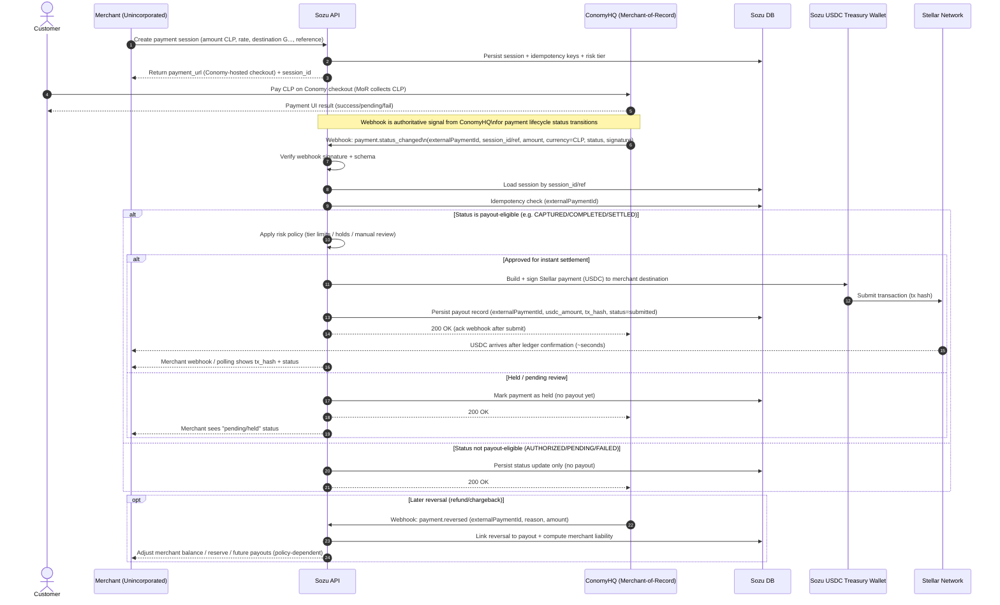

# ConomyHQ Fiat (CLP) → USDC (Stellar) Flow (Merchant-of-Record)

This diagram describes the **fiat-to-stablecoin settlement flow** where **ConomyHQ** acts as **Merchant-of-Record (MoR)** to collect **CLP** from end customers on behalf of **unincorporated Chilean merchants**, while **Sozu** settles **USDC on Stellar** to the merchant wallet within seconds (webhook → tx submit).

## Roles

- **Customer**: Pays in **CLP** using payment methods supported by ConomyHQ.
- **ConomyHQ (MoR)**: Collects CLP, performs required compliance/processing, and emits **webhooks** for payment lifecycle events.
- **Sozu**: Orchestrates sessions, validates webhooks, applies idempotency/risk policy, and submits USDC payouts on Stellar from a pre-funded treasury wallet.
- **Merchant (Unincorporated)**: Receives USDC to a Stellar address (custodied or self-custodied).
- **Stellar Network**: Settlement rail for USDC transfers.

## End-to-end flow (diagram)

## “Settling in seconds” (what it means)

- **Seconds** here means: **from ConomyHQ payout-eligible webhook receipt to Stellar transaction submission**.
- **On-chain finality** occurs after Stellar ledger confirmation (typically a few seconds). Merchant UX should show:
  - `tx_hash` immediately after submission
  - `confirmed` once the tx is in a ledger

## Key implementation notes (to keep the flow safe)

- **Idempotency**: use ConomyHQ’s `externalPaymentId` (and/or event id) to guarantee “at most one” USDC payout.
- **Payout eligibility**: only settle when ConomyHQ status indicates funds are sufficiently final for your risk appetite.
- **Risk tiers**: new/unincorporated merchants should start with conservative limits and/or reserves to handle reversals.
- **Treasury prefunding**: instant settlement generally implies Sozu fronts USDC and reconciles fiat with ConomyHQ later.

Customer ConomyHQ (MoR) Sozu API Sozu DB Sozu USDC Treasury Stellar Network Merchant
| | | | | | |
| 1) Merchant creates | | | | | |
| checkout session | | | | | |
|<-----------------------------------------------------| Create session (CLP amt, rate, destination G..., reference) |
| | |------------------------->| Store session + risk tier + idempotency keys |
| | |<-------------------------| |
| | | Return payment_url + session_id |
| |<-----------------------------------------------------| |
| | | | | | |
| 2) Customer pays CLP | | | | | |
|-------------------------->| Pay on Conomy checkout | | | | |
| | (Conomy collects CLP) | | | | |
| | | | | | |
| 3) Conomy webhook to Sozu | | | | | |
| |------------------------->| Webhook: status_changed(externalPaymentId, session/ref, amount CLP, status, signature) |
| | | Verify signature + schema |
| | |------------------------->| Load session by session/ref |
| | |------------------------->| Idempotency check (externalPaymentId) |
| | | | | | |
| 4) If payout-eligible | | | | | |
| status (captured/ | | | | | |
| completed/settled): | | | | | |
| | | Apply risk policy (tier limits / hold / review) |
| | | (A) Instant settle
| | |----------------------------------------------------->| Build + sign Stellar USDC transfer |
| | | |----------------------->| Submit tx (tx_hash) |
| | |------------------------->| Store payout record (tx_hash, status=submitted) |
| |<-------------------------| 200 OK (ack webhook after submit) |
| | | | |------------------->| Confirm in ledger (~seconds) |
| | | | | |------------------->| USDC received |
| | | Merchant sees tx_hash immediately; later “confirmed” via polling/webhook |
| | | (B) Held / pending review
| | |------------------------->| Mark payment HELD (no payout yet) |
| |<-------------------------| 200 OK Merchant sees “pending/held” |
| | | | | | |
| 5) If NOT payout-eligible | | | | | |
| (pending/authorized/ | | | | | |
| failed): | |------------------------->| Store status only (no payout) |
| |<-------------------------| 200 OK Merchant sees “pending/failed” |
| | | | | | |
| 6) Optional reversal | | | | | |
| later (refund/ | | | | | |
| chargeback): | | | | | |
| |------------------------->| Webhook: payment.reversed(externalPaymentId, reason, amount) |
| | |------------------------->| Link reversal to payout + compute liability/reserve |
| | | Merchant balance adjusted / future payouts withheld (policy-dependent) |
