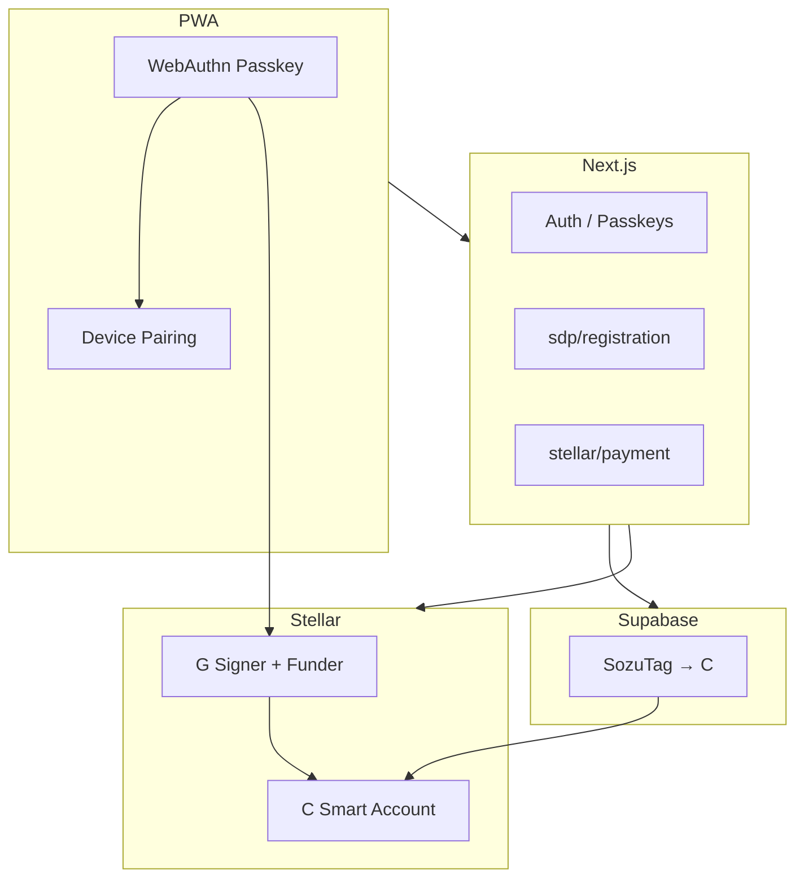

# Sozu Credit — Master Changelog & Project Report

**Document type:** Single source of truth for stakeholder / SCF / internal distribution  
**Report period (4 weeks):** 6 May 2026 – 3 June 2026  
**Project span covered:** 31 October 2025 – 3 June 2026  
**Repository:** SozuCredit (`main`)  
**Total commits (lifespan):** 167  
**Generated:** 3 June 2026  
**HEAD:** `756ef0d` — fix(sdp): reset stale SEP-24 session when switching Sozu accounts

---

## How to use this document

| Audience | Read |
|----------|------|
| **4-week report (distribution)** | [Part B](#part-b--four-week-distribution-report-6-may--3-jun-2026) — Weeks 1–4 |
| **Full project story** | [Part A](#part-a--project-foundation-31-oct-2025--5-may-2026) + Part B |
| **Technical depth (signing, SDP, infra)** | [Cross-cutting reference](#cross-cutting-reference-infrastructure-signing-passkeys-e2e) |
| **Raw commit forensics** | [Appendix — complete commit log](#appendix--complete-commit-log-167-entries) |

---

## Executive summary (3 June 2026)

Sozu Credit evolved from an **October 2025 passkey wallet prototype** (Turnkey-era G wallets, trust points, early DeFindex) into a **June 2026 mobile PWA** with:

- **OpenZeppelin Soroban smart accounts (C)** as the canonical balance holder  
- **WebAuthn passkey** as signer (G derived) + server **fee-payer relayer**  
- **Circle USDC SAC + Blend USDC** balances and **DeFindex** yield  
- **SozuTag** directory shared with **Sozu Pay** (tags → C when provisioned)  
- **SDP beneficiary onboarding** fully inside Sozu (email/DOB → passkey → OTP → fund request)  
- **Device pairing** (`/auth/add-device`) for a second phone on the same account  

The **four-week report window** captures **93 commits** (7 + 0 + 6 + 80). **80% of report-period work landed in Week 4** (27 May – 3 Jun), matching the smart-account and SDP production push.

---

## Table of contents

1. [Part A — Project foundation](#part-a--project-foundation-31-oct-2025--5-may-2026)
2. [Part B — Four-week report](#part-b--four-week-distribution-report-6-may--3-jun-2026)
3. [Cross-cutting reference](#cross-cutting-reference-infrastructure-signing-passkeys-e2e)
4. [Current state & unpushed work](#current-state--unpushed-work-3-june-2026)
5. [Appendix — complete commit log](#appendix--complete-commit-log-167-entries)

---

# PART A — Project foundation (31 Oct 2025 – 5 May 2026)

## A.1 Phase 1 — Inception (31 Oct – 1 Nov 2025)

**Commits:** 17  

**Product born:** passkey authentication, wallet page, trust points, profile sheet, SozuTag/username APIs, PWA installability, Turnkey-oriented Stellar wallet generation, mobile swipe UX, CORS + Vercel rpID fixes, DeFindex integration foundation and referral links.

**Impact today:** Established passkey-first identity, community trust narrative, and Stellar wallet as core product — all later work extends this base.

### Commit log

| Date | Hash | Message |
|------|------|---------|
| 2025-10-31 | `8ff7e4d` | feat: implement wallet page with trust points, profile sheet, and passkey authentication |
| 2025-10-31 | `cfa524b` | fix: add CORS headers to API routes and health endpoint |
| 2025-10-31 | `a7e8323` | fix: correct rpID for Vercel deployment |
| 2025-10-31 | `751d45b` | feat: improve trust modal UX and mobile animation optimization |
| 2025-10-31 | `48499fa` | Update wallet UI: remove backgrounds/borders from trust points and wallet icon, update profile buttons to white border no bg, add wallet address copy functionality, and prepare Turnkey wallet integration structure |
| 2025-10-31 | `6fee7b0` | Update wallet UI buttons: transparent backgrounds with white borders, add glassmorphic effect to trust points modal |
| 2025-10-31 | `3eee304` | Update README: clear value proposition, passkeys-powered, high-yield DeFi, education gateway, and community vouching. Add Defindex/Blend protocol integration plan. |
| 2025-10-31 | `ac75f7c` | feat: implement Stellar wallet generation with Turnkey integration |
| 2025-10-31 | `19a07c4` | feat: Add mobile swipe gestures, XLM balance display, and mobile optimizations |
| 2025-10-31 | `3a6aa98` | fix: Fix auth page viewport and improve swipe gesture reliability |
| 2025-10-31 | `aca3bd8` | Add profile API and username management |
| 2025-11-01 | `f69467b` | Add PWA setup for SozuCredit |
| 2025-11-01 | `c2ce0ae` | Fix: Restore animated background on auth and wallet pages |
| 2025-11-01 | `13fc0dd` | Fix: Ensure one wallet per user persists across logins |
| 2025-11-01 | `2a85438` | Fix: Ensure passkeys persist and wallets remain consistent |
| 2025-11-01 | `348c643` | feat: Add DeFindex integration foundation |
| 2025-11-01 | `ba7f842` | feat: Update referral message to include clickable URL |

## A.2 Phase 2 — Core wallet, DeFindex, trust & credit (Nov 2025)

**Commits:** 45  

**Major delivery:** DeFindex auto-deposit (Soroban + DB position tracking), Blend protocol, balance animations, passkey RLS fixes, one-wallet-per-user guarantees, MaxFlow trust points, vouching, credit request feature, notifications, USDC trustlines (Turnkey signing era), referral system merges.

**Impact today:** Yield/DeFi plumbing and community credit mechanics; many Nov modules were refactored in May–Jun 2026 for C-wallets but product intent persists.

### Commit log

| Date | Hash | Message |
|------|------|---------|
| 2025-11-01 | `8cd6c3f` | feat: set black background for PWA and redirect to /auth |
| 2025-11-01 | `b908ce6` | feat: update wallet page and defindex vault integration |
| 2025-11-01 | `26b4525` | Merge branch 'feature/defindex-integration' |
| 2025-11-01 | `8853ffa` | fix: resolve Next.js 16 build errors |
| 2025-11-03 | `e244fa1` | feat: Add sliding number animation with decimal support and currency-based balance animations |
| 2025-11-04 | `5a2c8ba` | fix: Use service client for passkey storage to bypass RLS during registration |
| 2025-11-04 | `f7bc0c5` | fix: Use service client for passkey storage to bypass RLS during registration |
| 2025-11-04 | `c3502fa` | feat: Add mobile video background for wallet page |
| 2025-11-04 | `ffbcffd` | debug: Add video loading debug logs for troubleshooting |
| 2025-11-04 | `8058bf8` | fix: Ensure mobile uses video background only, desktop uses animated pattern only |
| 2025-11-04 | `daa92f6` | fix: Prevent duplicate wallet creation and ensure consistent userId usage |
| 2025-11-05 | `277528c` | Fix passkey authentication and wallet balance display |
| 2025-11-05 | `ad28582` | Add DeFindex deposit implementation roadmap |
| 2025-11-05 | `801cb94` | Update DeFindex deposit plan: auto-deposit focus and Peanut Protocol offramp |
| 2025-11-05 | `72fe778` | Update Phase 3: Peanut Protocol offramp integration |
| 2025-11-05 | `3e1c686` | Replace Phase 3 with Peanut Protocol offramp integration |
| 2025-11-05 | `4f6e571` | Update DeFindex deposit plan with architecture overview |
| 2025-11-05 | `10e1414` | Merge feature/defindex-integration into main |
| 2025-11-05 | `10dbaac` | Implement Phase 1: Soroban contract integration for auto-deposit |
| 2025-11-05 | `0825dda` | feat: Implement database-based balance tracking for auto-deposit |
| 2025-11-06 | `b4e4743` | docs: Add DeFindex environment setup guide |
| 2025-11-06 | `22e30a0` | feat: Implement Phase 2 - Database schema for strategy positions |
| 2025-11-06 | `d473f02` | feat: Complete auto-deposit system with UI integration and background automation |
| 2025-11-06 | `1c014f3` | docs: Add completion summary for auto-deposit system implementation |
| 2025-11-06 | `6682e7d` | fix: Resolve APY display component import errors |
| 2025-11-06 | `d9e10a5` | fix: Resolve TypeScript errors in wallet page |
| 2025-11-06 | `61a841c` | fix: Update APY API and display component for proper fallback handling |
| 2025-11-06 | `af03849` | fix: Update balance fetching to use database position tracking |
| 2025-11-06 | `2ceaa37` | docs: Add debugging and funding scripts for balance testing |
| 2025-11-06 | `604958c` | feat: Enhanced ARS balance animation and DeFi Vault integration |
| 2025-11-06 | `58f5d51` | feat: Complete DeFi integration with ARS animation and Blend protocol |
| 2025-11-07 | `7127c62` | feat: Add MaxFlow ego score integration, EVM address linking, and USDC trustline creation |
| 2025-11-07 | `80bdd6c` | feat: Add credit request feature |
| 2025-11-07 | `4aae95e` | feat: Fix copy invite link and add credit request feature plan |
| 2025-11-09 | `768a089` | feat: Implement USDC trustline establishment with Turnkey signing |
| 2025-11-10 | `f341055` | feat: Add notifications system and improve auth/passkey handling |
| 2025-11-10 | `f84a172` | feat: Complete MaxFlow trust points integration with vouching system |
| 2025-11-10 | `88f9a29` | feat: Implement referral-based trust points system |
| 2025-11-10 | `933f559` | Merge main into credit-request: Combine notifications system with referral system |
| 2025-11-10 | `2392849` | feat: improve passkey auth flow and fix referral system |
| 2025-11-10 | `a9391ab` | Merge maxflow-trust-tokens-integration into feature/credit-request |
| 2025-11-10 | `ace2c69` | Add trustworthy vouches system for credit eligibility |
| 2025-11-10 | `0d8ec8b` | Fix build errors and UI improvements |
| 2025-11-10 | `f38c57a` | Fix notification sound, profile picture persistence, vouch duplicates, and balance formatting |
| 2025-11-10 | `cfb3948` | Fix balance audit API to support x-user-id header fallback for production |

## A.3 Phase 3 — Winter maintenance (Jan 2026)

**Commits:** 10  

Payment flow fixes, PWA branding, account deletion, duplicate account fixes, Next.js 16.0.7 security patch (CVE-2025-66478), mobile UI, signing prompt ordering (sign after tx prepared), onboarding fixes, profile sheet / notifications build fixes, wallet menu swipe-to-close.

**Impact today:** Production stability baseline before spring sprint.

### Commit log

| Date | Hash | Message |
|------|------|---------|
| 2026-01-13 | `d425fb1` | feat: Complete payment flow fixes and PWA branding |
| 2026-01-13 | `751ed5a` | Add account deletion feature, fix duplicate accounts, and improve transaction history |
| 2026-01-13 | `7b8ad43` | Fix TypeScript errors for Vercel build |
| 2026-01-13 | `6143300` | Update Next.js to 16.0.7 to fix CVE-2025-66478 security vulnerability |
| 2026-01-17 | `367edd4` | ui mobile updates, fixed signing prompt before tx is sent |
| 2026-01-17 | `06a559a` | fixed build errors on onboarding fixes |
| 2026-01-22 | `3fbc142` | feat: update auth animation, fix profile sheet build error, and optimize pwa |
| 2026-01-22 | `96304dc` | fix: resolve build errors in use-notifications.ts and wallet-texts.ts |
| 2026-01-23 | `ff2bbc1` | fix: add close button and swipe-to-close functionality to wallet side menu |
| 2026-01-24 | `623c712` | fix: secret key display, settings navigation, and auth handling |

## A.4 Phase 4 — Quiet period (Feb–Mar 2026)

**Commits:** 0  

No commits — planning / ops focus outside repo.

### Commit log

*No commits in this window.*

## A.5 Phase 5 — Activation & prod signing (Apr – 5 May 2026)

**Commits:** 2  

Wallet activation, testnet funding surfaces, prod signing fixes, Sozu tag resolution improvements — bridge into multicurrency ledger work.

### Commit log

| Date | Hash | Message |
|------|------|---------|
| 2026-04-30 | `8bcfd7c` | Ship wallet activation, testnet funding, and product surfaces |
| 2026-04-30 | `91543ee` | fix(wallet): prod signing and Sozu tag resolution |

# PART B — Four-week distribution report (6 May – 3 Jun 2026)

## B.1 Report Week 1 · 6–12 May 2026

**Commits:** 7  

**Themes:** Email ledger multicurrency, vault workflows, ledger UX, passkeys for two devices, PIN backup auth, smarter Gmail sync.

**Impact:** Operational finance tooling + stronger multi-device credential story before mobile wallet sprint.

### Commit log

| Date | Hash | Message |
|------|------|---------|
| 2026-05-06 | `5136555` | feat: ship multicurrency ledger and wallet/vault workflow updates |
| 2026-05-06 | `0bfc998` | feat: improve ledger transaction editing responsiveness and UX |
| 2026-05-06 | `910eb04` | Merge branch 'feature/email-ledger-multicurrency' |
| 2026-05-06 | `46b4669` | fix: restore Vercel build and align ledger goals store types |
| 2026-05-09 | `fe9499b` | fix: allow ledger routes without Supabase session; use getUserId for ledger API headers |
| 2026-05-09 | `373c507` | feat(ledger): iOS-safe tap haptics for nav and summary |
| 2026-05-10 | `1b4d3b8` | feat: passkeys for two devices, PIN backup auth, smarter Gmail sync |

## B.2 Report Week 2 · 13–19 May 2026

**Commits:** 0  

**No repository commits** — use this week in the distributed report for planning, SDP/Railway coordination, or offline QA (no git activity).

### Commit log

*No commits in this window.*

## B.3 Report Week 3 · 20–26 May 2026

**Commits:** 6  

**Themes:** SDP wallet onboarding entry, paper shader, mobile app shell, QR scanner, PWA icon/splash/preloader, hydration fixes, profile register service client.

**Impact:** Transition from ledger-centric work to **mobile PWA + SDP beneficiary entry**.

### Commit log

| Date | Hash | Message |
|------|------|---------|
| 2026-05-25 | `0df2ccb` | Add SDP wallet onboarding, persistent paper shader background, and ledger polish. |
| 2026-05-26 | `d95240c` | feat: mobile shell, QR scanner, payment fixes, and profile repair |
| 2026-05-26 | `d98f0b1` | fix: use in-scope service client for profile mutations in register/verify |
| 2026-05-26 | `a66283d` | feat: PWA icon, splash screen, and app preloader |
| 2026-05-26 | `9cfb4d9` | fix: hydration crash after auth and QR scan detection |
| 2026-05-26 | `11846b2` | fix: proper React-managed preloader to prevent hydration crash on mobile |

## B.4 Report Week 4 · 27 May – 3 Jun 2026

**Commits:** 80  

**Themes (densest week — 80 commits):** OZ C-wallet default, Soroban USDC sends, passkey auth_digest signing, DeFindex one-click yield, PWA/session/send polish, **full in-app SDP registration**, SEP-10/SEP-24 alignment, ops scripts for SDP admin, ISO DOB verify, multi-account session hygiene.

**Impact:** Current production architecture — passkey + C smart account + in-app SDP + shared SozuTag directory with Sozu Pay.

### Commit log

| Date | Hash | Message |
|------|------|---------|
| 2026-05-28 | `46743fe` | fix(auth): allow /auth?sdpInvite=1 when Supabase session exists |
| 2026-05-29 | `985871c` | feat: credit page, treasury UX, and bilingual wallet polish |
| 2026-05-29 | `92ac401` | fix(register): simplify /sdp/register to single passkey action |
| 2026-05-29 | `db18c93` | feat: receipt sharing, fiat send input, and SDP register polish |
| 2026-05-29 | `167b681` | fix(register): send x-user-id header for passkey-only sessions |
| 2026-05-29 | `fef3ed5` | fix(register): use x-stellar-public-key header fallback for passkey wallets not in DB |
| 2026-05-29 | `b0eda1f` | fix: derive WALLET_CLIENT_DOMAIN from NEXT_PUBLIC_APP_URL if not set |
| 2026-05-29 | `ab381bf` | fix: pass SDP-Tenant-Name header on all SDP API calls |
| 2026-05-29 | `a85e5c6` | fix: sign with client-domain key before verifyChallengeTxSigners |
| 2026-05-29 | `a9bc8bf` | feat(sdp): Spanish register UI, tenant redirect fix, and passkey CTA styling |
| 2026-05-29 | `81d9168` | docs(sdp): document Railway SDP_ALLOWED_DOMAINS for production E2E |
| 2026-05-29 | `b768e05` | feat(sdp): verify beneficiary name and DOB before passkey fund request |
| 2026-05-29 | `520f833` | feat(wallet): improve balance display and add haptics dependency |
| 2026-05-29 | `9b693af` | feat(defi): one-click yield earning via DeFindex + Blend integration |
| 2026-05-29 | `8fc505b` | feat(wallet): wallet switcher modal, onboarding polish, PWA install, and auth UX fixes |
| 2026-05-29 | `f902f49` | fix(build): exclude video/ subfolder from root tsconfig to prevent Remotion type errors on Vercel |
| 2026-05-29 | `51e02c6` | fix(build): wrap MobileAppShell in Suspense to satisfy useSearchParams boundary requirement |
| 2026-05-29 | `2b532a3` | feat(session): persistent session + fix Spanish onboarding first slide |
| 2026-05-29 | `c4ff146` | fix(build): use static import for clearClientSession in profile-sheet (await not allowed in non-async) |
| 2026-05-29 | `c196a0a` | fix: settings logout, Android UI, PWA gap, onboarding swipe + CTA |
| 2026-05-29 | `5551c8f` | fix: settings shader visible, PWA bottom gap (dvh), install banner toast |
| 2026-05-29 | `1dee0a2` | fix: remove legacy create-wallet buttons, Spanish PWA copy, ledger shader, PWA gap |
| 2026-05-29 | `779c0df` | feat(send): transparent modal bg + real-time SozuTag validation |
| 2026-05-29 | `a0664fe` | fix(send): left-align balance in modal to match balance card position |
| 2026-05-29 | `7a75f1a` | fix(send): align payment modal UX and improve Sozu tag resolution. |
| 2026-05-30 | `032b181` | fix(pwa): tighten mobile viewport layout on auth and home. |
| 2026-05-30 | `e456c03` | fix(pwa): resolve mobile viewport gap and improve send modal UX. |
| 2026-05-30 | `3699977` | fix(pwa): remove bottom black gap across all standalone pages. |
| 2026-05-30 | `8256a75` | Fix iOS PWA viewport gap, Spanish auth defaults, and payment address handling. |
| 2026-05-30 | `c65024c` | feat(wallet): OpenZeppelin smart accounts and Soroban USDC payments by default. |
| 2026-05-30 | `41cc3af` | Fix SDP registration UX and auth layout for tablet/desktop. |
| 2026-05-30 | `7b5946e` | Unify wallet on C smart account for balance and Soroban sends. |
| 2026-05-30 | `f78ea1e` | Provision C smart wallet on registration and block G as primary. |
| 2026-05-30 | `c01893c` | Improve mobile UX: history scroll, deposit modal, ledger background. |
| 2026-05-30 | `54d047a` | Fix post-passkey redirect loop to /auth. |
| 2026-05-30 | `5dc4e78` | Fix C-wallet BlendUSDC balance reads and polish mobile wallet UX. |
| 2026-05-30 | `503c3e5` | Show Circle USDC SAC balance on C wallets in the balance card. |
| 2026-05-30 | `696372a` | Fix balance card stuck at $0 after DeFindex fetch race |
| 2026-05-30 | `4628656` | Harden Soroban balance reads and audit breakdown for Blend vs Circle SAC |
| 2026-05-30 | `06f735d` | Fix 500 on balance API for C smart accounts (Horizon) |
| 2026-05-30 | `6c9f045` | Fix Soroban sends: use G signer as tx source, not C contract |
| 2026-05-30 | `2358cc7` | Fix factory smart wallet sends without get_context_rules. |
| 2026-05-30 | `b05c062` | Route OZ passkey wallets to WebAuthn auth, not G ed25519. |
| 2026-05-30 | `ea25dc2` | Fix passkey public key parsing and single WebAuthn send prompt. |
| 2026-05-31 | `5de1c8d` | Use on-chain signer keyData for Soroban passkey auth. |
| 2026-05-31 | `a2c12f9` | Route wallets without get_context_rules away from OZ kit signing. |
| 2026-05-31 | `3b400ff` | Fix OZ passkey keyData to use WebAuthn assertion rawId. |
| 2026-05-31 | `26136e0` | Fix legacy smart wallet sends using on-chain signer keyData. |
| 2026-05-31 | `b2d1055` | Fix duplicate normalizeCredentialId import breaking Vercel build. |
| 2026-05-31 | `9413f3f` | Fix Soroban simulation type checks for Vercel TypeScript build. |
| 2026-05-31 | `0b5dcdf` | Align Soroban passkey signing with smart-account-kit WebAuthn flow. |
| 2026-05-31 | `044b9c0` | Fix passkey Soroban sends and payment UI flow. |
| 2026-06-01 | `6cc1839` | Fix SDP passkey signing when session stores smart account C address. |
| 2026-06-01 | `560b660` | Fix SDP signing when credential_id or IndexedDB G key is missing. |
| 2026-06-01 | `c249850` | Sync DB signer to passkey-derived G before SDP SEP-10 signing. |
| 2026-06-01 | `b83e5bd` | Fix SEP-10 challenge account to match passkey-derived signer. |
| 2026-06-01 | `2e00b3b` | Fix SDP signing for existing wallets with registered G signer. |
| 2026-06-01 | `fee087e` | Fix legacy passkey key derivation for existing SDP wallets. |
| 2026-06-02 | `f31daf4` | Fix SDP fund request by signing SEP-10 with the user wallet G. |
| 2026-06-02 | `3cc4eb8` | Fix SDP OTP verification by aligning SEP-24 account with SEP-10 JWT. |
| 2026-06-02 | `df206d2` | Simplify SDP flow: org-branded copy, email before passkey. |
| 2026-06-02 | `f049e50` | Fix SDP verification: require email+DOB on Sozu, default SEP-24 to C account. |
| 2026-06-02 | `5b669f8` | Complete SDP registration in Sozu UI without redirecting to SDP. |
| 2026-06-02 | `558ae3f` | fix(sdp): improve OTP verification with DOB editing and clearer errors. |
| 2026-06-02 | `aa1ef8f` | fix(sdp): use ISO text input for DOB and hint to check spam for OTP. |
| 2026-06-02 | `197184c` | debug(sdp): instrument DOB verify flow and surface verificationSent on errors. |
| 2026-06-02 | `3623063` | fix(sdp): clarify duplicate-email DOB failures and reset session on new invite. |
| 2026-06-02 | `8abad5f` | fix(sdp): hint at blank CSV default DOB when batch verify fails. |
| 2026-06-02 | `9f97416` | verify/loolup ISO variants to debug 'not found' sdp error |
| 2026-06-02 | `787c31e` | fix(sdp): ISO-only verify and surface SDP error codes |
| 2026-06-02 | `43b1acf` | fix(scripts): diagnose SDP admin login and password policy |
| 2026-06-02 | `86fc4b8` | docs(scripts): reset SDP admin password via Railway logs |
| 2026-06-02 | `c6e7891` | fix(scripts): list SDP auth_users and document owner email mismatch |
| 2026-06-02 | `f51852d` | fix(scripts): preflight SDP admin email against auth_users |
| 2026-06-02 | `5a00c61` | fix(scripts): surface existing SDP reset token when request is noop |
| 2026-06-02 | `ab0af54` | fix(sdp): use page_limit 100 for admin receiver listing |
| 2026-06-02 | `ea6d05c` | fix(sdp): enrich registration verify errors with batch and wallet context |
| 2026-06-02 | `df2a115` | fix(sdp): point registration errors to Send invites campaign start |
| 2026-06-02 | `d0c526c` | fix(sdp): passkey cancel fallback and clearer verify 500 errors |
| 2026-06-02 | `756ef0d` | fix(sdp): reset stale SEP-24 session when switching Sozu accounts |

# Cross-cutting reference (infrastructure, signing, passkeys, E2E)

Consolidates technical narrative from the May–June development push (included in prior internal changelog drafts).

---

## Infrastructure & deployment

| Layer | Role | Notes |
|-------|------|-------|
| **Vercel** | Sozu Credit Next.js app | Build fixes: exclude `video/`, `Suspense` for `useSearchParams`, Soroban TS types |
| **Railway** | SDP backend | `SDP_ALLOWED_DOMAINS` for production E2E; admin password via scripts |
| **Supabase** | Auth, profiles, passkeys, `stellar_wallets` | OZ/factory schema SQL in `docs/supabase-stellar-wallet-*.sql` |
| **Soroban RPC** | Simulation + submit | `STELLAR_FUNDER_SECRET` pays fees on behalf of users |
| **Stellar testnet** | OZ WASM, verifier, threshold policy | Env-documented in `smart-account-default-payments.md` |

**Critical env:** `NEXT_PUBLIC_RP_ID` must match the hostname used at passkey registration (localhost vs production vs ngrok permanently binds credentials).

**SDP proxy headers:** `SDP-Tenant-Name`; `x-user-id` / `x-stellar-public-key` for passkey-only sessions.

---

## Signing methodology (current)

| Role | Address | Purpose |
|------|---------|---------|
| Smart wallet (USDC) | **C…** | Soroban contract — balance, receive, SEP-24 default account |
| Passkey signer | **G…** | Derived from WebAuthn; SEP-10 challenges; Soroban auth entries |
| Fee payer | **G…** (funder) | `STELLAR_FUNDER_SECRET` — **C cannot be tx source** |

### Send path matrix

| `wallet_type` | Condition | Path |
|---------------|-----------|------|
| `oz` | `get_context_rules` OK | `oz_passkey` — smart-account-kit |
| `oz` | no `get_context_rules` | `oz_passkey_local` — manual WebAuthn + `auth_digest` |
| `factory` | — | `smart_g_signer` |
| `legacy` | — | Classic Horizon payment |

**OZ fix (May 31):** Current WASM requires WebAuthn signature over **`auth_digest`** = `sha256(signature_payload || context_rule_ids_xdr)`, with `AuthPayload` on credentials. See `docs/fixes/oz-passkey-soroban-send.md`.

**SDP fix (Jun 1–2):** SEP-10 uses **passkey G**; SEP-24 interactive deposit uses **C**; JWT account alignment required for OTP (`3cc4eb8`).

---

## Passkey auth & shared credential / multi-device access

### Storage model

| Store | Contents |
|-------|----------|
| Browser WebAuthn | Platform passkey |
| Supabase `passkeys` | `credential_id`, `user_id` |
| IndexedDB | Encrypted G seed (`browser-keys.ts`) |
| `stellar_wallets` | C address, signer G, `oz_credential_id`, `wallet_type` |

### SozuTag admin & shared directory

- `profiles.username` ↔ `stellar_wallets.public_key` — **shared with Sozu Pay**.
- After C provision, sends and deposits target **contract address**, not legacy G.
- Real-time SozuTag validation in send modal (`779c0df`).

### Second device (self-custodial, same wallet)

1. Primary device: `POST /api/auth/passkeys/pairing/init` → 10-minute pairing code.  
2. New device: `/auth/add-device` + SozuTag + code → WebAuthn create → same `user_id` and **C** wallet.  
3. Week 1 (May 10): `feat: passkeys for two devices, PIN backup auth` — foundation for multi-device credentials.

### SDP operator tooling (Jun 2)

Scripts: `sdp-reset-password.mjs`, `sdp-list-auth-users.mjs`, `sdp-diagnose-admin-env.mjs`, `sdp-lookup-receiver-dob.mjs`, `generate-local-sdp-invite.mjs` — documented in `docs/sdp-admin-password-recovery.md`.

---

## SDP in-app flow (Week 4 milestone)

```
Invite → contact (email + ISO DOB, verify-identity)
      → passkey (SEP-10 on G + C provision)
      → otp (registration/otp + verify)
      → done (SEP-24 fund request)
```

**Routes:** `verify-identity`, `registration/otp`, `registration/verify`, `registration/status`, `registration/info`, `sdp/context`, `sep24/deposit`.

**Milestone commit:** `5b669f8` — Complete SDP registration in Sozu UI without redirecting to SDP.

---

## Dependencies introduced (report period)

| Package | Week | Role |
|---------|------|------|
| `@paper-design/shaders-react` | 3 | Ledger/auth shader |
| `@blend-capital/blend-sdk` | 4 | Blend USDC |
| `@defindex/sdk` | 4 | Vault yield |
| `smart-account-kit` + bindings | 4 | OZ deploy/sign |
| `@simplewebauthn/browser` | 4 | WebAuthn alignment |
| `@noble/curves` | 4 | P-256 helpers |

---

## E2E verification checklist

| Flow | Command / route |
|------|-----------------|
| Soroban send | Send USDC between C wallets; one WebAuthn prompt |
| Wallet diagnose | `node scripts/probe-wallet.mjs <C>` |
| DeFindex | `GET /api/test/auto-deposit-e2e?strategyId=fixed`; `pnpm exec tsx scripts/test-defi-e2e.ts` |
| SDP beneficiary | Production invite → email/DOB → passkey → OTP → fund request |
| SDP production | Railway `SDP_ALLOWED_DOMAINS` + aligned `NEXT_PUBLIC_RP_ID` |
| Multi-device | Pairing code → `/auth/add-device` on second phone (same origin) |

---

## Architecture (June 2026)



---

# Current state & unpushed work (3 June 2026)

| Item | Status |
|------|--------|
| Production `main` | `756ef0d` — SDP session reset on account switch |
| **Unpushed local** | `scf-community-fund-toast.tsx`, `SCFbanner.avif`, minor `app/auth/page.tsx` |

---

# Appendix — complete commit log (167 entries)

Chronological list of every commit from project inception through 3 June 2026.

| Date | Hash | Message |
|------|------|---------|
| 2025-10-31 | `8ff7e4d` | feat: implement wallet page with trust points, profile sheet, and passkey authentication |
| 2025-10-31 | `cfa524b` | fix: add CORS headers to API routes and health endpoint |
| 2025-10-31 | `a7e8323` | fix: correct rpID for Vercel deployment |
| 2025-10-31 | `751d45b` | feat: improve trust modal UX and mobile animation optimization |
| 2025-10-31 | `48499fa` | Update wallet UI: remove backgrounds/borders from trust points and wallet icon, update profile buttons to white border no bg, add wallet address copy functionality, and prepare Turnkey wallet integration structure |
| 2025-10-31 | `6fee7b0` | Update wallet UI buttons: transparent backgrounds with white borders, add glassmorphic effect to trust points modal |
| 2025-10-31 | `3eee304` | Update README: clear value proposition, passkeys-powered, high-yield DeFi, education gateway, and community vouching. Add Defindex/Blend protocol integration plan. |
| 2025-10-31 | `ac75f7c` | feat: implement Stellar wallet generation with Turnkey integration |
| 2025-10-31 | `19a07c4` | feat: Add mobile swipe gestures, XLM balance display, and mobile optimizations |
| 2025-10-31 | `3a6aa98` | fix: Fix auth page viewport and improve swipe gesture reliability |
| 2025-10-31 | `aca3bd8` | Add profile API and username management |
| 2025-11-01 | `f69467b` | Add PWA setup for SozuCredit |
| 2025-11-01 | `c2ce0ae` | Fix: Restore animated background on auth and wallet pages |
| 2025-11-01 | `13fc0dd` | Fix: Ensure one wallet per user persists across logins |
| 2025-11-01 | `2a85438` | Fix: Ensure passkeys persist and wallets remain consistent |
| 2025-11-01 | `348c643` | feat: Add DeFindex integration foundation |
| 2025-11-01 | `ba7f842` | feat: Update referral message to include clickable URL |
| 2025-11-01 | `8cd6c3f` | feat: set black background for PWA and redirect to /auth |
| 2025-11-01 | `b908ce6` | feat: update wallet page and defindex vault integration |
| 2025-11-01 | `26b4525` | Merge branch 'feature/defindex-integration' |
| 2025-11-01 | `8853ffa` | fix: resolve Next.js 16 build errors |
| 2025-11-03 | `e244fa1` | feat: Add sliding number animation with decimal support and currency-based balance animations |
| 2025-11-04 | `5a2c8ba` | fix: Use service client for passkey storage to bypass RLS during registration |
| 2025-11-04 | `f7bc0c5` | fix: Use service client for passkey storage to bypass RLS during registration |
| 2025-11-04 | `c3502fa` | feat: Add mobile video background for wallet page |
| 2025-11-04 | `ffbcffd` | debug: Add video loading debug logs for troubleshooting |
| 2025-11-04 | `8058bf8` | fix: Ensure mobile uses video background only, desktop uses animated pattern only |
| 2025-11-04 | `daa92f6` | fix: Prevent duplicate wallet creation and ensure consistent userId usage |
| 2025-11-05 | `277528c` | Fix passkey authentication and wallet balance display |
| 2025-11-05 | `ad28582` | Add DeFindex deposit implementation roadmap |
| 2025-11-05 | `801cb94` | Update DeFindex deposit plan: auto-deposit focus and Peanut Protocol offramp |
| 2025-11-05 | `72fe778` | Update Phase 3: Peanut Protocol offramp integration |
| 2025-11-05 | `3e1c686` | Replace Phase 3 with Peanut Protocol offramp integration |
| 2025-11-05 | `4f6e571` | Update DeFindex deposit plan with architecture overview |
| 2025-11-05 | `10e1414` | Merge feature/defindex-integration into main |
| 2025-11-05 | `10dbaac` | Implement Phase 1: Soroban contract integration for auto-deposit |
| 2025-11-05 | `0825dda` | feat: Implement database-based balance tracking for auto-deposit |
| 2025-11-06 | `b4e4743` | docs: Add DeFindex environment setup guide |
| 2025-11-06 | `22e30a0` | feat: Implement Phase 2 - Database schema for strategy positions |
| 2025-11-06 | `d473f02` | feat: Complete auto-deposit system with UI integration and background automation |
| 2025-11-06 | `1c014f3` | docs: Add completion summary for auto-deposit system implementation |
| 2025-11-06 | `6682e7d` | fix: Resolve APY display component import errors |
| 2025-11-06 | `d9e10a5` | fix: Resolve TypeScript errors in wallet page |
| 2025-11-06 | `61a841c` | fix: Update APY API and display component for proper fallback handling |
| 2025-11-06 | `af03849` | fix: Update balance fetching to use database position tracking |
| 2025-11-06 | `2ceaa37` | docs: Add debugging and funding scripts for balance testing |
| 2025-11-06 | `604958c` | feat: Enhanced ARS balance animation and DeFi Vault integration |
| 2025-11-06 | `58f5d51` | feat: Complete DeFi integration with ARS animation and Blend protocol |
| 2025-11-07 | `7127c62` | feat: Add MaxFlow ego score integration, EVM address linking, and USDC trustline creation |
| 2025-11-07 | `80bdd6c` | feat: Add credit request feature |
| 2025-11-07 | `4aae95e` | feat: Fix copy invite link and add credit request feature plan |
| 2025-11-09 | `768a089` | feat: Implement USDC trustline establishment with Turnkey signing |
| 2025-11-10 | `f341055` | feat: Add notifications system and improve auth/passkey handling |
| 2025-11-10 | `f84a172` | feat: Complete MaxFlow trust points integration with vouching system |
| 2025-11-10 | `88f9a29` | feat: Implement referral-based trust points system |
| 2025-11-10 | `933f559` | Merge main into credit-request: Combine notifications system with referral system |
| 2025-11-10 | `2392849` | feat: improve passkey auth flow and fix referral system |
| 2025-11-10 | `a9391ab` | Merge maxflow-trust-tokens-integration into feature/credit-request |
| 2025-11-10 | `ace2c69` | Add trustworthy vouches system for credit eligibility |
| 2025-11-10 | `0d8ec8b` | Fix build errors and UI improvements |
| 2025-11-10 | `f38c57a` | Fix notification sound, profile picture persistence, vouch duplicates, and balance formatting |
| 2025-11-10 | `cfb3948` | Fix balance audit API to support x-user-id header fallback for production |
| 2026-01-13 | `d425fb1` | feat: Complete payment flow fixes and PWA branding |
| 2026-01-13 | `751ed5a` | Add account deletion feature, fix duplicate accounts, and improve transaction history |
| 2026-01-13 | `7b8ad43` | Fix TypeScript errors for Vercel build |
| 2026-01-13 | `6143300` | Update Next.js to 16.0.7 to fix CVE-2025-66478 security vulnerability |
| 2026-01-17 | `367edd4` | ui mobile updates, fixed signing prompt before tx is sent |
| 2026-01-17 | `06a559a` | fixed build errors on onboarding fixes |
| 2026-01-22 | `3fbc142` | feat: update auth animation, fix profile sheet build error, and optimize pwa |
| 2026-01-22 | `96304dc` | fix: resolve build errors in use-notifications.ts and wallet-texts.ts |
| 2026-01-23 | `ff2bbc1` | fix: add close button and swipe-to-close functionality to wallet side menu |
| 2026-01-24 | `623c712` | fix: secret key display, settings navigation, and auth handling |
| 2026-04-30 | `8bcfd7c` | Ship wallet activation, testnet funding, and product surfaces |
| 2026-04-30 | `91543ee` | fix(wallet): prod signing and Sozu tag resolution |
| 2026-05-06 | `5136555` | feat: ship multicurrency ledger and wallet/vault workflow updates |
| 2026-05-06 | `0bfc998` | feat: improve ledger transaction editing responsiveness and UX |
| 2026-05-06 | `910eb04` | Merge branch 'feature/email-ledger-multicurrency' |
| 2026-05-06 | `46b4669` | fix: restore Vercel build and align ledger goals store types |
| 2026-05-09 | `fe9499b` | fix: allow ledger routes without Supabase session; use getUserId for ledger API headers |
| 2026-05-09 | `373c507` | feat(ledger): iOS-safe tap haptics for nav and summary |
| 2026-05-10 | `1b4d3b8` | feat: passkeys for two devices, PIN backup auth, smarter Gmail sync |
| 2026-05-25 | `0df2ccb` | Add SDP wallet onboarding, persistent paper shader background, and ledger polish. |
| 2026-05-26 | `d95240c` | feat: mobile shell, QR scanner, payment fixes, and profile repair |
| 2026-05-26 | `d98f0b1` | fix: use in-scope service client for profile mutations in register/verify |
| 2026-05-26 | `a66283d` | feat: PWA icon, splash screen, and app preloader |
| 2026-05-26 | `9cfb4d9` | fix: hydration crash after auth and QR scan detection |
| 2026-05-26 | `11846b2` | fix: proper React-managed preloader to prevent hydration crash on mobile |
| 2026-05-28 | `46743fe` | fix(auth): allow /auth?sdpInvite=1 when Supabase session exists |
| 2026-05-29 | `985871c` | feat: credit page, treasury UX, and bilingual wallet polish |
| 2026-05-29 | `92ac401` | fix(register): simplify /sdp/register to single passkey action |
| 2026-05-29 | `db18c93` | feat: receipt sharing, fiat send input, and SDP register polish |
| 2026-05-29 | `167b681` | fix(register): send x-user-id header for passkey-only sessions |
| 2026-05-29 | `fef3ed5` | fix(register): use x-stellar-public-key header fallback for passkey wallets not in DB |
| 2026-05-29 | `b0eda1f` | fix: derive WALLET_CLIENT_DOMAIN from NEXT_PUBLIC_APP_URL if not set |
| 2026-05-29 | `ab381bf` | fix: pass SDP-Tenant-Name header on all SDP API calls |
| 2026-05-29 | `a85e5c6` | fix: sign with client-domain key before verifyChallengeTxSigners |
| 2026-05-29 | `a9bc8bf` | feat(sdp): Spanish register UI, tenant redirect fix, and passkey CTA styling |
| 2026-05-29 | `81d9168` | docs(sdp): document Railway SDP_ALLOWED_DOMAINS for production E2E |
| 2026-05-29 | `b768e05` | feat(sdp): verify beneficiary name and DOB before passkey fund request |
| 2026-05-29 | `520f833` | feat(wallet): improve balance display and add haptics dependency |
| 2026-05-29 | `9b693af` | feat(defi): one-click yield earning via DeFindex + Blend integration |
| 2026-05-29 | `8fc505b` | feat(wallet): wallet switcher modal, onboarding polish, PWA install, and auth UX fixes |
| 2026-05-29 | `f902f49` | fix(build): exclude video/ subfolder from root tsconfig to prevent Remotion type errors on Vercel |
| 2026-05-29 | `51e02c6` | fix(build): wrap MobileAppShell in Suspense to satisfy useSearchParams boundary requirement |
| 2026-05-29 | `2b532a3` | feat(session): persistent session + fix Spanish onboarding first slide |
| 2026-05-29 | `c4ff146` | fix(build): use static import for clearClientSession in profile-sheet (await not allowed in non-async) |
| 2026-05-29 | `c196a0a` | fix: settings logout, Android UI, PWA gap, onboarding swipe + CTA |
| 2026-05-29 | `5551c8f` | fix: settings shader visible, PWA bottom gap (dvh), install banner toast |
| 2026-05-29 | `1dee0a2` | fix: remove legacy create-wallet buttons, Spanish PWA copy, ledger shader, PWA gap |
| 2026-05-29 | `779c0df` | feat(send): transparent modal bg + real-time SozuTag validation |
| 2026-05-29 | `a0664fe` | fix(send): left-align balance in modal to match balance card position |
| 2026-05-29 | `7a75f1a` | fix(send): align payment modal UX and improve Sozu tag resolution. |
| 2026-05-30 | `032b181` | fix(pwa): tighten mobile viewport layout on auth and home. |
| 2026-05-30 | `e456c03` | fix(pwa): resolve mobile viewport gap and improve send modal UX. |
| 2026-05-30 | `3699977` | fix(pwa): remove bottom black gap across all standalone pages. |
| 2026-05-30 | `8256a75` | Fix iOS PWA viewport gap, Spanish auth defaults, and payment address handling. |
| 2026-05-30 | `c65024c` | feat(wallet): OpenZeppelin smart accounts and Soroban USDC payments by default. |
| 2026-05-30 | `41cc3af` | Fix SDP registration UX and auth layout for tablet/desktop. |
| 2026-05-30 | `7b5946e` | Unify wallet on C smart account for balance and Soroban sends. |
| 2026-05-30 | `f78ea1e` | Provision C smart wallet on registration and block G as primary. |
| 2026-05-30 | `c01893c` | Improve mobile UX: history scroll, deposit modal, ledger background. |
| 2026-05-30 | `54d047a` | Fix post-passkey redirect loop to /auth. |
| 2026-05-30 | `5dc4e78` | Fix C-wallet BlendUSDC balance reads and polish mobile wallet UX. |
| 2026-05-30 | `503c3e5` | Show Circle USDC SAC balance on C wallets in the balance card. |
| 2026-05-30 | `696372a` | Fix balance card stuck at $0 after DeFindex fetch race |
| 2026-05-30 | `4628656` | Harden Soroban balance reads and audit breakdown for Blend vs Circle SAC |
| 2026-05-30 | `06f735d` | Fix 500 on balance API for C smart accounts (Horizon) |
| 2026-05-30 | `6c9f045` | Fix Soroban sends: use G signer as tx source, not C contract |
| 2026-05-30 | `2358cc7` | Fix factory smart wallet sends without get_context_rules. |
| 2026-05-30 | `b05c062` | Route OZ passkey wallets to WebAuthn auth, not G ed25519. |
| 2026-05-30 | `ea25dc2` | Fix passkey public key parsing and single WebAuthn send prompt. |
| 2026-05-31 | `5de1c8d` | Use on-chain signer keyData for Soroban passkey auth. |
| 2026-05-31 | `a2c12f9` | Route wallets without get_context_rules away from OZ kit signing. |
| 2026-05-31 | `3b400ff` | Fix OZ passkey keyData to use WebAuthn assertion rawId. |
| 2026-05-31 | `26136e0` | Fix legacy smart wallet sends using on-chain signer keyData. |
| 2026-05-31 | `b2d1055` | Fix duplicate normalizeCredentialId import breaking Vercel build. |
| 2026-05-31 | `9413f3f` | Fix Soroban simulation type checks for Vercel TypeScript build. |
| 2026-05-31 | `0b5dcdf` | Align Soroban passkey signing with smart-account-kit WebAuthn flow. |
| 2026-05-31 | `044b9c0` | Fix passkey Soroban sends and payment UI flow. |
| 2026-06-01 | `6cc1839` | Fix SDP passkey signing when session stores smart account C address. |
| 2026-06-01 | `560b660` | Fix SDP signing when credential_id or IndexedDB G key is missing. |
| 2026-06-01 | `c249850` | Sync DB signer to passkey-derived G before SDP SEP-10 signing. |
| 2026-06-01 | `b83e5bd` | Fix SEP-10 challenge account to match passkey-derived signer. |
| 2026-06-01 | `2e00b3b` | Fix SDP signing for existing wallets with registered G signer. |
| 2026-06-01 | `fee087e` | Fix legacy passkey key derivation for existing SDP wallets. |
| 2026-06-02 | `f31daf4` | Fix SDP fund request by signing SEP-10 with the user wallet G. |
| 2026-06-02 | `3cc4eb8` | Fix SDP OTP verification by aligning SEP-24 account with SEP-10 JWT. |
| 2026-06-02 | `df206d2` | Simplify SDP flow: org-branded copy, email before passkey. |
| 2026-06-02 | `f049e50` | Fix SDP verification: require email+DOB on Sozu, default SEP-24 to C account. |
| 2026-06-02 | `5b669f8` | Complete SDP registration in Sozu UI without redirecting to SDP. |
| 2026-06-02 | `558ae3f` | fix(sdp): improve OTP verification with DOB editing and clearer errors. |
| 2026-06-02 | `aa1ef8f` | fix(sdp): use ISO text input for DOB and hint to check spam for OTP. |
| 2026-06-02 | `197184c` | debug(sdp): instrument DOB verify flow and surface verificationSent on errors. |
| 2026-06-02 | `3623063` | fix(sdp): clarify duplicate-email DOB failures and reset session on new invite. |
| 2026-06-02 | `8abad5f` | fix(sdp): hint at blank CSV default DOB when batch verify fails. |
| 2026-06-02 | `9f97416` | verify/loolup ISO variants to debug 'not found' sdp error |
| 2026-06-02 | `787c31e` | fix(sdp): ISO-only verify and surface SDP error codes |
| 2026-06-02 | `43b1acf` | fix(scripts): diagnose SDP admin login and password policy |
| 2026-06-02 | `86fc4b8` | docs(scripts): reset SDP admin password via Railway logs |
| 2026-06-02 | `c6e7891` | fix(scripts): list SDP auth_users and document owner email mismatch |
| 2026-06-02 | `f51852d` | fix(scripts): preflight SDP admin email against auth_users |
| 2026-06-02 | `5a00c61` | fix(scripts): surface existing SDP reset token when request is noop |
| 2026-06-02 | `ab0af54` | fix(sdp): use page_limit 100 for admin receiver listing |
| 2026-06-02 | `ea6d05c` | fix(sdp): enrich registration verify errors with batch and wallet context |
| 2026-06-02 | `df2a115` | fix(sdp): point registration errors to Send invites campaign start |
| 2026-06-02 | `d0c526c` | fix(sdp): passkey cancel fallback and clearer verify 500 errors |
| 2026-06-02 | `756ef0d` | fix(sdp): reset stale SEP-24 session when switching Sozu accounts |


---

## Related documents

| File | Purpose |
|------|---------|
| [development-log-2026-05-23-to-2026-06-02.md](./development-log-2026-05-23-to-2026-06-02.md) | Architecture narrative (May sprint) |
| [changelog-2026-05-24-to-2026-06-03.md](./changelog-2026-05-24-to-2026-06-03.md) | Ten-day operational changelog |
| [smart-account-default-payments.md](./smart-account-default-payments.md) | C-wallet env & troubleshooting |
| [fixes/oz-passkey-soroban-send.md](./fixes/oz-passkey-soroban-send.md) | auth_digest root cause |
| [sdp-admin-password-recovery.md](./sdp-admin-password-recovery.md) | SDP operator recovery |

---

*This master report supersedes fragmented logs for distribution purposes. Update the dated bullet in [project-history.md](./project-history.md) when the next reporting period closes.*
