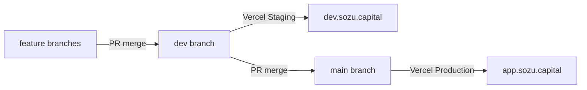

# Git flow for Sozu Wallet

Agent and developer reference for the Sozu Wallet promotion chain.

## Branch model

```yaml
featureBase: dev
deployTrigger: main
promotion: feature → dev → main
vercelProject: sozu-wallet   # rename from sozu-credit
githubRepo: blessedux/sozu-wallet  # rename from SozuCredit
```



| Environment | Git branch | Domain | Vercel target |
|-------------|------------|--------|---------------|
| Staging | `dev` | `dev.sozu.capital` | Custom **Staging** on `sozu-wallet` |
| Production | `main` | `app.sozu.capital` | **Production** on `sozu-wallet` (closed beta) |
| PR previews | feature PRs | `*.vercel.app` | Preview |

## Day-to-day workflow

1. **Feature work:** Branch from `dev`, PR into `dev` → Staging at `dev.sozu.capital`
2. **Release:** PR `dev` → `main` → Production at `app.sozu.capital`
3. **Closed-beta / deposit tests:** Use Staging (`dev.sozu.capital`) — never a second Vercel project
4. **Protect branches:** Required PR reviews on `main` (and ideally `dev`)

## Agent instructions

When implementing tickets with `/ship-ticket` or similar:

- **Feature branches** from `dev`, merge back to `dev`
- **Deposit / P2P ramp testing** on Staging before promoting to Production
- **Production releases** require a separate PR from `dev` → `main`
- **Do not** create another Vercel project for feature flags

## Why separate Staging and Production?

**Passkey binding:** WebAuthn credentials are origin-bound. A passkey on `dev.sozu.capital` cannot unlock `app.sozu.capital`.

- Staging: `NEXT_PUBLIC_RP_ID=dev.sozu.capital`
- Production: `NEXT_PUBLIC_RP_ID=app.sozu.capital`

## Closed beta

Closed beta = Production env flags (`NEXT_PUBLIC_BETA_TIER=closed`, deposits on), not a fork or second project. See [vercel-consolidation.md](../vercel-consolidation.md).

## Historical note

Previously: two Vercel projects (`sozu-credit` / `credit.sozu.capital` and `sozu-cosed-beta` / `app.sozu.capital`). That split is deprecated — consolidate per the cutover guide.
