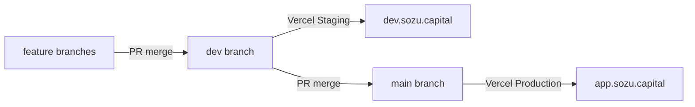

# Git flow for Sozu Wallet (app.sozu.capital)

Agent and developer reference for the Sozu Wallet promotion chain.

## Branch model

```yaml
featureBase: dev
deployTrigger: main
promotion: feature → dev → main
```



| Environment | Git branch | Domain | Vercel target |
|-------------|------------|--------|---------------|
| Staging | `dev` | `dev.sozu.capital` | Custom **Staging** env on `sozu-credit` |
| Production | `main` | `app.sozu.capital` | **Production** on `sozu-credit` |
| PR previews | feature PRs | `*.vercel.app` | Preview (no fixed hostname) |

## Day-to-day workflow

1. **Feature work:** Branch from `dev`, PR into `dev` → auto Staging deploy at `dev.sozu.capital`
2. **Release:** PR `dev` → `main` → Production deploy at `app.sozu.capital`
3. **Protect branches:** Configure required PR reviews on `main` (and ideally `dev`) when ready

## Agent instructions

When implementing tickets with `/ship-ticket` or similar:

- **Feature branches** should be created from `dev` and merged back to `dev`
- **Testing** happens on Staging (`dev.sozu.capital`) before promoting to Production
- **Production releases** require a separate PR from `dev` → `main`

## Why separate dev and main?

**Passkey binding:** WebAuthn credentials are origin-bound. A passkey registered on `dev.sozu.capital` cannot be used on `app.sozu.capital`. This separation ensures:

- Staging testing with staging passkeys (`NEXT_PUBLIC_RP_ID=dev.sozu.capital`)
- Production users with production passkeys (`NEXT_PUBLIC_RP_ID=app.sozu.capital`)
- No credential conflicts between environments

See [docs/deployment.md](../deployment.md) for the full Vercel setup and environment variable configuration.

## Historical note

Prior to this setup, Sozu Wallet used two separate Vercel projects (`sozu-credit-open` for `credit.sozu.capital` and `sozu-credit-closed` for `app.sozu.capital`). The current model consolidates onto a single project (`sozu-credit`) with Staging and Production environments controlled by branch assignment.
