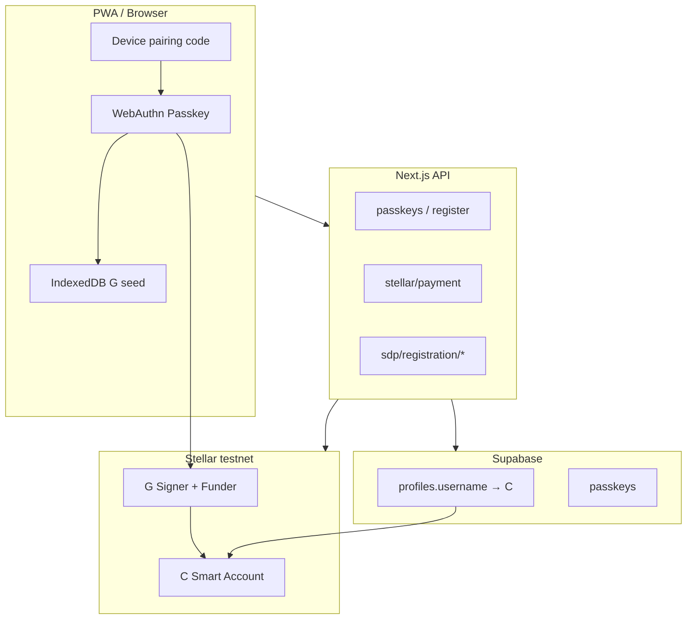

# Sozu Credit — Changelog (24 May – 3 June 2026)

**Window:** 10 calendar days ending **3 June 2026**  
**Branch:** `main` (synced with `origin/main` at `756ef0d`)  
**Volume:** **86 commits** pushed in this period  
**Companion doc:** [development-log-2026-05-23-to-2026-06-02.md](./development-log-2026-05-23-to-2026-06-02.md) (architecture deep-dive through 2 Jun morning)

---

## Where the project stands today (3 June 2026)

Sozu Credit is a **mobile-first PWA** with a **passkey-first, self-custodial Stellar wallet**:

| Layer | State |
|-------|--------|
| **Identity** | WebAuthn passkeys in Supabase `passkeys`; optional **device pairing** to add a passkey on a second phone |
| **Wallet** | Default **OpenZeppelin Soroban smart account (C)**; **G** is passkey-derived signer + relayer fee payer |
| **Assets** | **Circle USDC SAC** (receive default) + **Blend USDC**; **DeFindex** one-click yield |
| **Payments** | Soroban `transfer` with **auth_digest** WebAuthn signing for current OZ WASM |
| **Tags** | **SozuTag** (`profiles.username`) shared with **Sozu Pay** → resolves to **C** when provisioned |
| **SDP** | Full beneficiary onboarding **in Sozu** (email/DOB → passkey → OTP → fund request), no SDP UI redirect |
| **Deploy** | Next.js on **Vercel**; SDP backend on **Railway**; Supabase for auth + wallet rows |

**Latest pushed commit:** `756ef0d` (2 Jun 2026) — reset stale SEP-24 session when switching Sozu accounts during SDP registration.

**Local only (not pushed, 3 Jun):** SCF Community Fund toast + banner assets; minor `app/auth/page.tsx` tweak.

---

## Executive impact summary

1. **Architecture:** Moved from classic **G + Horizon** to **C smart account + Soroban** as canonical balance holder; G retained only as signer and fee payer.
2. **Signing:** Fixed OZ passkey `__check_auth` by signing **`auth_digest`** (not raw payload); split **kit** vs **local WebAuthn** paths by `get_context_rules`.
3. **SDP E2E:** Closed the loop for NGO beneficiaries entirely in-app; hardened DOB/OTP/SEP-10/SEP-24 account alignment; added ops scripts for Railway SDP admin.
4. **Mobile:** PWA shell, persistent session, viewport/`dvh` fixes, send/deposit/history polish — production-usable on iOS/Android.
5. **DeFindex:** Shipped earn flow; refined vault deposit asset selection (Blend vs Circle SAC) in `9f97416`.
6. **Multi-device access:** Pairing codes (`/auth/add-device`) let a user add a passkey on a new phone without losing the same SozuTag + C wallet (same Supabase user).

---

## Infrastructure & environment

| Component | What changed | Impact |
|-----------|--------------|--------|
| **Vercel (Sozu Credit)** | Build fixes: exclude `video/` from root tsconfig; `Suspense` around `MobileAppShell`; Soroban TS simulation types | Reliable production deploys |
| **Railway (SDP)** | Documented `SDP_ALLOWED_DOMAINS`; admin password recovery via scripts + logs | Production SDP invite + registration E2E |
| **Supabase** | `wallet_type`, `oz_credential_id`, signer columns (`supabase-stellar-wallet-*.sql`) | C-address + passkey metadata persisted |
| **Soroban RPC** | `SOROBAN_RPC_URL`, funder `STELLAR_FUNDER_SECRET` | Server-side simulation + submit |
| **Stellar testnet** | OZ WASM `3e51f5b2…`, WebAuthn verifier + threshold policy contract IDs | OZ deploy + passkey auth |
| **USDC contracts** | `TESTNET_USDC_CONTRACT_ADDRESS` (Blend), `TESTNET_CIRCLE_USDC_SAC_CONTRACT_ADDRESS` | Separate receive vs pool balances |
| **App URL / rpID** | `WALLET_CLIENT_DOMAIN` derived from `NEXT_PUBLIC_APP_URL`; explicit `NEXT_PUBLIC_RP_ID` | Passkeys bound to correct origin — **critical** for signing |

**SDP headers (all BFF → SDP API):**

- `SDP-Tenant-Name` — tenant scoping (`ab381bf`)
- `x-user-id` / `x-stellar-public-key` — passkey-only sessions without Supabase JWT (`167b681`, `fef3ed5`)

---

## Dependencies added or upgraded (period)

| Package | Introduced | Role |
|---------|------------|------|
| `@paper-design/shaders-react` | 25 May | Ledger / auth paper shader background |
| `@blend-capital/blend-sdk` | 29 May | Blend pool / USDC |
| `@defindex/sdk` | 29 May | Vault strategies, one-click yield |
| `smart-account-kit` + `smart-account-kit-bindings` | 30 May | OZ deploy + `signAuthEntry` |
| `@simplewebauthn/browser` | 31 May | Browser WebAuthn alignment with kit |
| `@noble/curves` | 31 May | P-256 / passkey crypto helpers |
| Haptics (via wallet commit) | 29 May | Mobile send feedback |

Existing core: `@stellar/stellar-sdk` ^14.3, `@supabase/*`, Next 16, React 19.

---

## Signing methodology — evolution & current matrix

### Timeline of signing fixes

| Date | Problem | Fix |
|------|---------|-----|
| **29 May** | SDP SEP-10 verify failed | Sign with **client-domain key** before `verifyChallengeTxSigners` (`a85e5c6`) |
| **30 May** | Sends used C as tx source | **G signer** as Soroban source; C authorizes via auth (`6c9f045`) |
| **30 May** | OZ wallets used ed25519 G path | Route to **WebAuthn** (`b05c062`) |
| **31 May** | `InvalidAction` on `__check_auth` | **auth_digest** + `AuthPayload` with `context_rule_ids` ([oz-passkey-soroban-send.md](./fixes/oz-passkey-soroban-send.md)) |
| **31 May** | Wrong keyData | On-chain signer **keyData**; **rawId** for OZ (`5de1c8d`, `3b400ff`) |
| **1–2 Jun** | SDP fund request / OTP | SEP-10 account = **passkey G**; SEP-24 account = **C**; sync DB signer before SEP-10 (`f31daf4` → `3cc4eb8`) |

### Send path matrix (production behavior)

| `wallet_type` | Contract probe | Client/server path |
|---------------|----------------|-------------------|
| `oz` | `get_context_rules` OK | `oz_passkey` — `smart-account-kit` `signAuthEntry` |
| `oz` | no `get_context_rules` | `oz_passkey_local` — manual WebAuthn + `ozAuthPayload.ts` |
| `factory` | — | `smart_g_signer` — G fee payer + `authorizeEntry` |
| `legacy` | — | Classic Horizon `Operation.payment` |

**Relayer model:** `STELLAR_FUNDER_SECRET` pays fees; user passkey proves authorization on C.

**SDP SEP-10:** Always signs with **passkey-derived G**, never session’s C address (`6cc1839`, `b83e5bd`, `c249850`).

---

## Passkey auth & shared credential system

### Passkey storage model

| Store | Contents |
|-------|----------|
| **Browser WebAuthn** | Platform passkey (Face ID / fingerprint) |
| **Supabase `passkeys`** | `credential_id`, `user_id`, metadata for server verification |
| **IndexedDB** (`browser-keys.ts`) | Encrypted **G seed** derived from credential — used for legacy/factory paths and SDP when kit path unavailable |
| **`stellar_wallets`** | `public_key` = **C**, `signer_public_key` = **G**, `oz_credential_id`, `wallet_type` |

### Shared tag directory (Sozu Credit ↔ Sozu Pay)

- `profiles.username` (SozuTag) maps to `stellar_wallets.public_key`.
- After smart-wallet provision, directory stores **C**, not G — sends and SDP deposits target the contract account.
- `GET /api/wallet/resolve-recipient` + real-time validation in send modal (`779c0df`, `7a75f1a`).

### Multi-device / “fresh phone” access (self-custodial, same account)

**Goal:** Admin or power user keeps one SozuTag; adds passkey on a new device without new wallet.

| Step | Mechanism |
|------|-----------|
| 1. Primary device | Settings → generate **pairing code** (`POST /api/auth/passkeys/pairing/init`) — 10-char code, 10 min TTL, in-memory store |
| 2. New device | Open `/auth/add-device` → enter **SozuTag + pairing code** → WebAuthn **create** passkey |
| 3. Server | `add/verify` checks pairing entry matches username; links new `credential_id` to same `user_id` |
| 4. Result | Same Supabase user, same **C** wallet; new passkey can sign (if rpID matches) |

**Operational constraint:** `NEXT_PUBLIC_RP_ID` must match on both devices’ browser origin ([smart-account-default-payments.md](./smart-account-default-payments.md)).

### SozuTag admin / SDP ops (not passkey-shared, but “quick access” for operators)

June 2 added **SDP admin tooling** for campaign operators (password reset, receiver DOB lookup, tenant list):

| Script / doc | Purpose |
|--------------|---------|
| `scripts/sdp-reset-password.mjs` | Reset SDP admin password via Railway token |
| `scripts/sdp-list-auth-users.mjs` | List `auth_users` — catch email mismatch vs `SDP_ADMIN_EMAIL` |
| `scripts/sdp-diagnose-admin-env.mjs` | Env + password policy diagnosis |
| `scripts/sdp-lookup-receiver-dob.mjs` | Debug beneficiary DOB vs batch CSV |
| `scripts/generate-local-sdp-invite.mjs` | Local SDP invite for E2E |
| [sdp-admin-password-recovery.md](./sdp-admin-password-recovery.md) | Runbook |

These support **SDP dashboard admin**, not end-user wallet passkeys — but they unblock E2E when batch invites use blank default DOB (`8abad5f`).

---

## E2E processes & verification

### Wallet / payments E2E

| Check | How |
|-------|-----|
| New user → C provisioned | Passkey register → `ensureSmartWallet()` → `GET /api/wallet/stellar/balance` returns C + SAC |
| Soroban send | Send USDC to another tag; one WebAuthn prompt (`ea25dc2`) |
| OZ auth failure debug | `node scripts/probe-wallet.mjs <C>` + `validate-prepared-envelope.mjs` |
| Legacy G user | Classic payment path + UI notice |

### DeFindex E2E

| Check | How |
|-------|-----|
| Config + APY | `GET /api/test/auto-deposit-e2e?strategyId=fixed` |
| CLI | `pnpm exec tsx scripts/test-defi-e2e.ts [strategyId] [walletAddress]` |
| Vault asset | After `9f97416`: `vault-deposit-asset.ts` picks Blend vs Circle for deposits |

### SDP beneficiary E2E (full in-app)

```
Invite (?sdpInvite=1 or /sdp/invite)
  → contact: POST /api/sdp/verify-identity (email + ISO DOB)
  → passkey: SEP-10 on G + wallet provision (C)
  → otp: POST /api/sdp/registration/otp
  → verify: POST /api/sdp/registration/verify (DOB field + OTP)
  → done: SEP-24 deposit / fund request (account = C, JWT account = G signer alignment)
```

| Production gate | Requirement |
|-----------------|-------------|
| Domains | Railway `SDP_ALLOWED_DOMAINS` includes Vercel app host |
| Tenant | `SDP-Tenant-Name` on every SDP proxy call |
| DOB | ISO `YYYY-MM-DD` only (`787c31e`); blank CSV DOB hinted in UI (`8abad5f`) |
| Session | Reset SEP-24 when switching Sozu accounts (`756ef0d`) |

### Build / CI E2E

- Vercel production build must pass TS strict checks on Soroban simulation types (`9413f3f`).
- No Remotion types in app bundle (`f902f49`).

---

## Day-by-day changelog

### 2026-05-25 (1 commit)

| Commit | Summary | Impact |
|--------|---------|--------|
| `0df2ccb` | SDP wallet onboarding entry, paper shader, ledger polish | First-class SDP path from wallet; visual identity on ledger |

### 2026-05-26 (5 commits)

| Commit | Summary | Impact |
|--------|---------|--------|
| `d95240c` | Mobile shell, QR scanner, payments, profile repair | App-shaped mobile UX |
| `d98f0b1` | Service client scope for profile mutations | Register/verify no longer wrong Supabase client |
| `a66283d` | PWA icon, splash, preloader | Installable app surface |
| `9cfb4d9` | Hydration fix after auth / QR | Stability on mobile Safari |
| `11846b2` | React-managed preloader | Eliminates hydration crash from imperative DOM |

### 2026-05-28 (1 commit)

| Commit | Summary | Impact |
|--------|---------|--------|
| `46743fe` | Allow `/auth?sdpInvite=1` with existing session | Returning users can complete SDP without forced logout |

### 2026-05-29 (24 commits) — mobile product + DeFindex + SDP prep

**Themes:** wallet switcher, session persistence, credit/treasury pages, DeFindex yield, SDP Spanish UI, send modal, PWA `dvh` fixes.

Notable commits:

- `985871c` — credit page, treasury UX, bilingual polish  
- `9b693af` — DeFindex + Blend one-click yield  
- `8fc505b` — wallet switcher, onboarding, PWA install banner  
- `51e02c6` — persistent session across reloads  
- `b768e05` — verify name + DOB before passkey fund request  
- `a85e5c6` / `ab381bf` / `b0eda1f` — SDP signing + tenant header + client domain  
- `779c0df` / `7a75f1a` — SozuTag validation in send flow  
- `2b532a3` / `f902f49` — Vercel build fixes  

### 2026-05-30 (19 commits) — OZ smart accounts default

**Themes:** C-wallet as primary; Soroban USDC sends; balance reads; iOS PWA; SDP tablet layout.

| Commit | Summary | Impact |
|--------|---------|--------|
| `c65024c` | OZ smart accounts + Soroban USDC default | Architectural pivot |
| `7b5946e` | Unify balance/send on C | Single canonical address |
| `f78ea1e` | Provision C on registration; block G as primary | New users never stuck on G-only |
| `6c9f045` | G as tx source | Sends actually submit |
| `503c3e5` / `4628656` | Circle SAC + Blend breakdown | Correct balance display |
| `696372a` | DeFindex race → $0 balance | Balance card reliability |
| `54d047a` | Post-passkey redirect loop | Auth UX unblock |
| `8256a75` | iOS PWA viewport | Standalone mode usable |

### 2026-05-31 (8 commits) — passkey Soroban signing + universal token rail

| Commit | Summary | Impact |
|--------|---------|--------|
| `044b9c0` | Passkey sends + payment UI + token rail refactor | Production-grade sends |
| `0b5dcdf` | Kit WebAuthn alignment | Fewer manual auth bugs |
| `5de1c8d` / `3b400ff` / `26136e0` | On-chain keyData, rawId, legacy repair | Wallets created before fix still send |
| `a2c12f9` | Fallback when no `get_context_rules` | Factory/legacy contracts supported |
| `9413f3f` / `b2d1055` | Vercel TS build | Deploy green |

### 2026-06-01 (6 commits) — SDP SEP-10 / signer alignment

| Commit | Summary | Impact |
|--------|---------|--------|
| `6cc1839` | SDP signing when session has C address | Fund request no longer wrong account |
| `560b660` | Missing credential_id / IndexedDB G | Recovery paths for incomplete enrollments |
| `c249850` / `b83e5bd` | Sync DB signer to passkey G; SEP-10 challenge account | JWT matches signer |
| `fee087e` / `2e00b3b` | Legacy derivation + existing G signer | Old SDP wallets keep working |

### 2026-06-02 (22 commits) — in-app SDP completion + ops hardening

**Morning — product milestone**

| Commit | Summary | Impact |
|--------|---------|--------|
| `f31daf4` | SEP-10 with user wallet G | Fund request signing works |
| `3cc4eb8` | SEP-24 account = SEP-10 JWT account | OTP verification works |
| `df206d2` / `f049e50` | Email before passkey; DOB on Sozu; SEP-24 defaults to C | Fewer abandoned passkeys; clearer UX |
| `5b669f8` | **Complete registration in Sozu** — no SDP redirect | **Major milestone** |
| `558ae3f` / `aa1ef8f` | OTP + DOB editing, ISO input, spam hint | Supportable beneficiary UX |

**Afternoon — debug, ISO, admin scripts, session hygiene**

| Commit | Summary | Impact |
|--------|---------|--------|
| `197184c` | DOB verify instrumentation + local invite script | Dev/debug E2E |
| `3623063` / `8abad5f` | Duplicate email DOB errors; blank CSV DOB hint | Batch invite failures diagnosable |
| `787c31e` | ISO-only verify + SDP error codes | Consistent DOB format |
| `9f97416` | DOB lookup variants + DeFindex vault deposit asset + development log | DeFindex deposit correctness; doc consolidation |
| `43b1acf` → `86fc4b8` | SDP admin diagnose, reset password, auth_users list | **Operator quick access** to SDP |
| `ea6d05c` / `df2a115` / `d0c526c` | Richer verify errors; passkey cancel fallback | Production supportability |
| `756ef0d` | Reset stale SEP-24 on account switch | Multi-wallet SDP testing |

---

## Documentation created or updated (period)

| Document | Topic |
|----------|--------|
| [smart-account-default-payments.md](./smart-account-default-payments.md) | C default, env, troubleshooting |
| [fixes/oz-passkey-soroban-send.md](./fixes/oz-passkey-soroban-send.md) | auth_digest root cause |
| [architecture/universal-token-rail.md](./architecture/universal-token-rail.md) | contractId-first assets |
| [wallet-stellar-defindex.md](./wallet-stellar-defindex.md) | DeFindex env + E2E |
| [sdp-admin-password-recovery.md](./sdp-admin-password-recovery.md) | Railway admin recovery |
| [privacy-wallet-roadmap.md](./privacy-wallet-roadmap.md) | Long-term privacy stack |
| [development-log-2026-05-23-to-2026-06-02.md](./development-log-2026-05-23-to-2026-06-02.md) | Architecture narrative |
| SQL: `supabase-stellar-wallet-signer.sql`, `supabase-stellar-wallet-oz.sql` | DB schema |

---

## Uncommitted work (3 June 2026)

| Path | Status | Notes |
|------|--------|-------|
| `components/scf-community-fund-toast.tsx` | New | SCF promo toast (untracked) |
| `public/SCFbanner.avif` | New | Banner asset |
| `app/auth/page.tsx` | Modified (+3 lines) | Likely wires toast on auth |
| `.cursor/debug-d5ebeb.log` | Untracked | Debug only — do not commit |

---

## Recommended next verification (post-changelog)

- [ ] SDP full E2E on **production** URL with `SDP_ALLOWED_DOMAINS` + aligned `NEXT_PUBLIC_RP_ID`
- [ ] Pairing flow: primary → code → `/auth/add-device` on second phone (same rpID host)
- [ ] DeFindex deposit after vault-asset push: `test-defi-e2e.ts` + auto-deposit API
- [ ] Passkey registered only on `localhost` cannot sign on production — confirm migration messaging in Settings

---

## Architecture (current)



---

## Commit index (86 commits, chronological)

<details>
<summary>Full list — oldest first</summary>

```
0df2ccb 2026-05-25 Add SDP wallet onboarding, persistent paper shader background, and ledger polish.
d95240c 2026-05-26 feat: mobile shell, QR scanner, payment fixes, and profile repair
d98f0b1 2026-05-26 fix: use in-scope service client for profile mutations in register/verify
a66283d 2026-05-26 feat: PWA icon, splash screen, and app preloader
9cfb4d9 2026-05-26 fix: hydration crash after auth and QR scan detection
11846b2 2026-05-26 fix: proper React-managed preloader to prevent hydration crash on mobile
46743fe 2026-05-28 fix(auth): allow /auth?sdpInvite=1 when Supabase session exists
985871c 2026-05-29 feat: credit page, treasury UX, and bilingual wallet polish
92ac401 2026-05-29 fix(register): simplify /sdp/register to single passkey action
db18c93 2026-05-29 feat: receipt sharing, fiat send input, and SDP register polish
167b681 2026-05-29 fix(register): send x-user-id header for passkey-only sessions
fef3ed5 2026-05-29 fix(register): use x-stellar-public-key header fallback for passkey wallets not in DB
b0eda1f 2026-05-29 fix: derive WALLET_CLIENT_DOMAIN from NEXT_PUBLIC_APP_URL if not set
ab381bf 2026-05-29 fix: pass SDP-Tenant-Name header on all SDP API calls
a85e5c6 2026-05-29 fix: sign with client-domain key before verifyChallengeTxSigners
a9bc8bf 2026-05-29 feat(sdp): Spanish register UI, tenant redirect fix, and passkey CTA styling
81d9168 2026-05-29 docs(sdp): document Railway SDP_ALLOWED_DOMAINS for production E2E
b768e05 2026-05-29 feat(sdp): verify beneficiary name and DOB before passkey fund request
520f833 2026-05-29 feat(wallet): improve balance display and add haptics dependency
9b693af 2026-05-29 feat(defi): one-click yield earning via DeFindex + Blend integration
8fc505b 2026-05-29 feat(wallet): wallet switcher modal, onboarding polish, PWA install, and auth UX fixes
f902f49 2026-05-29 fix(build): exclude video/ subfolder from root tsconfig
51e02c62 2026-05-29 fix(build): wrap MobileAppShell in Suspense
2b532a35 2026-05-29 feat(session): persistent session + fix Spanish onboarding first slide
c4ff1466 2026-05-29 fix(build): use static import for clearClientSession in profile-sheet
c196a0ac 2026-05-29 fix: settings logout, Android UI, PWA gap, onboarding swipe + CTA
5551c8f4 2026-05-29 fix: settings shader visible, PWA bottom gap (dvh), install banner toast
1dee0a28 2026-05-29 fix: remove legacy create-wallet buttons, Spanish PWA copy, ledger shader, PWA gap
779c0df6 2026-05-29 feat(send): transparent modal bg + real-time SozuTag validation
a0664fe5 2026-05-29 fix(send): left-align balance in modal
7a75f1ac 2026-05-29 fix(send): align payment modal UX and improve Sozu tag resolution
032b181a 2026-05-30 fix(pwa): tighten mobile viewport layout on auth and home
e456c03e 2026-05-30 fix(pwa): resolve mobile viewport gap and improve send modal UX
36999776 2026-05-30 fix(pwa): remove bottom black gap across all standalone pages
8256a75c 2026-05-30 Fix iOS PWA viewport gap, Spanish auth defaults, and payment address handling
c65024ce 2026-05-30 feat(wallet): OpenZeppelin smart accounts and Soroban USDC payments by default
41cc3afe 2026-05-30 Fix SDP registration UX and auth layout for tablet/desktop
7b5946e9 2026-05-30 Unify wallet on C smart account for balance and Soroban sends
f78ea1ed 2026-05-30 Provision C smart wallet on registration and block G as primary
c01893c4 2026-05-30 Improve mobile UX: history scroll, deposit modal, ledger background
54d047ac 2026-05-30 Fix post-passkey redirect loop to /auth
5dc4e78b 2026-05-30 Fix C-wallet BlendUSDC balance reads and polish mobile wallet UX
503c3e52 2026-05-30 Show Circle USDC SAC balance on C wallets in the balance card
696372a0 2026-05-30 Fix balance card stuck at $0 after DeFindex fetch race
46286561 2026-05-30 Harden Soroban balance reads and audit breakdown for Blend vs Circle SAC
06f735df 2026-05-30 Fix 500 on balance API for C smart accounts (Horizon)
6c9f045f 2026-05-30 Fix Soroban sends: use G signer as tx source, not C contract
2358cc7b 2026-05-30 Fix factory smart wallet sends without get_context_rules
b05c0627 2026-05-30 Route OZ passkey wallets to WebAuthn auth, not G ed25519
ea25dc2b 2026-05-30 Fix passkey public key parsing and single WebAuthn send prompt
5de1c8d1 2026-05-31 Use on-chain signer keyData for Soroban passkey auth
a2c12f96 2026-05-31 Route wallets without get_context_rules away from OZ kit signing
3b400ff9 2026-05-31 Fix OZ passkey keyData to use WebAuthn assertion rawId
26136e0f 2026-05-31 Fix legacy smart wallet sends using on-chain signer keyData
b2d10550 2026-05-31 Fix duplicate normalizeCredentialId import breaking Vercel build
9413f3ff 2026-05-31 Fix Soroban simulation type checks for Vercel TypeScript build
0b5dcdff 2026-05-31 Align Soroban passkey signing with smart-account-kit WebAuthn flow
044b9c02 2026-05-31 Fix passkey Soroban sends and payment UI flow
6cc1839b 2026-06-01 Fix SDP passkey signing when session stores smart account C address
560b6606 2026-06-01 Fix SDP signing when credential_id or IndexedDB G key is missing
c249850f 2026-06-01 Sync DB signer to passkey-derived G before SDP SEP-10 signing
b83e5bd2 2026-06-01 Fix SEP-10 challenge account to match passkey-derived signer
2e00b3b2 2026-06-01 Fix SDP signing for existing wallets with registered G signer
fee087e5 2026-06-01 Fix legacy passkey key derivation for existing SDP wallets
f31daf47 2026-06-02 Fix SDP fund request by signing SEP-10 with the user wallet G
3cc4eb80 2026-06-02 Fix SDP OTP verification by aligning SEP-24 account with SEP-10 JWT
df206d25 2026-06-02 Simplify SDP flow: org-branded copy, email before passkey
f049e509 2026-06-02 Fix SDP verification: require email+DOB on Sozu, default SEP-24 to C account
5b669f8c 2026-06-02 Complete SDP registration in Sozu UI without redirecting to SDP
558ae3f6 2026-06-02 fix(sdp): improve OTP verification with DOB editing and clearer errors
aa1ef8fc 2026-06-02 fix(sdp): use ISO text input for DOB and hint to check spam for OTP
197184c7 2026-06-02 debug(sdp): instrument DOB verify flow and surface verificationSent on errors
36230633 2026-06-02 fix(sdp): clarify duplicate-email DOB failures and reset session on new invite
8abad5f1 2026-06-02 fix(sdp): hint at blank CSV default DOB when batch verify fails
9f974165 2026-06-02 verify/lookup ISO variants + DeFindex vault deposit asset + development log
787c31e9 2026-06-02 fix(sdp): ISO-only verify and surface SDP error codes
43b1acf3 2026-06-02 fix(scripts): diagnose SDP admin login and password policy
86fc4b87 2026-06-02 docs(scripts): reset SDP admin password via Railway logs
c6e7891c 2026-06-02 fix(scripts): list SDP auth_users and document owner email mismatch
f51852da 2026-06-02 fix(scripts): preflight SDP admin email against auth_users
5a00c612 2026-06-02 fix(scripts): surface existing SDP reset token when request is noop
ab0af542 2026-06-02 fix(sdp): use page_limit 100 for admin receiver listing
ea6d05cb 2026-06-02 fix(sdp): enrich registration verify errors with batch and wallet context
df2a1157 2026-06-02 fix(sdp): point registration errors to Send invites campaign start
d0c526c4 2026-06-02 fix(sdp): passkey cancel fallback and clearer verify 500 errors
756ef0d2 2026-06-02 fix(sdp): reset stale SEP-24 session when switching Sozu accounts
```

</details>

---

*Generated from `git log --since=2026-05-24` on 2026-06-03. Append dated bullets to [project-history.md](./project-history.md) when the next milestone closes.*
