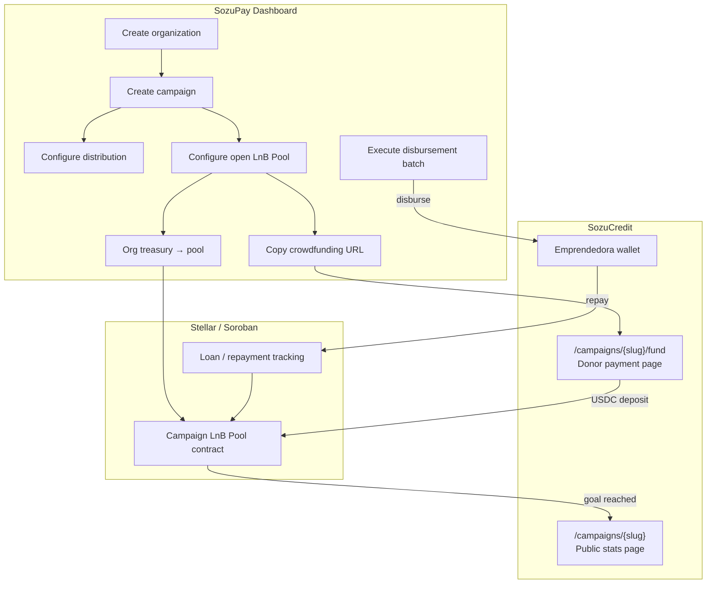

# Sozu Credit Marketplace — Product Roadmap

**Vision:** Build the most accessible lending and borrowing marketplace in Latin America — self-custodial, compliant, and transparent — without Sozu ever taking custody of user funds.

**This document lives in SozuCredit** because the recipient wallet and public-facing surfaces (donor pages, campaign transparency, borrower wallets) ship here. NGO operator workflows (org setup, campaign administration, batch disbursements) ship in **[SozuPay Dashboard](https://github.com/blessedux/SozuPay_dashboard)**.

**First operator partner:** [MUJERES 2000](https://github.com/blessedux/SozuPay_dashboard/blob/main/docs/03-planning/ngo-disbursement-wallet-dev-plan.md) — EMPRENDE microcredit in Argentina.

---

## Core thesis

Traditional lending is limited by slow underwriting, geographic restrictions, banking requirements, manual collections, and opaque risk.

Sozu enables:

```text
Capital → Smart Contracts → Borrowers → Automated Repayment → Lenders
```

Funds move **directly between users and smart contracts**. Sozu is infrastructure — not a bank, not a lender, not a custody provider.

**Stack path:**

```text
Passkeys → Smart Accounts → Compliance Credentials → Programmable Credit → Stellar Settlement
```

See also: [architecture-and-platform.md](./architecture-and-platform.md), [community-trust-and-credit.md](./community-trust-and-credit.md), and SozuPay [roadmap.md](https://github.com/blessedux/SozuPay_dashboard/blob/main/docs/00-overview/roadmap.md).

---

## Ecosystem split

| Surface | Repository | Domain | Primary users |
|---------|------------|--------|---------------|
| **NGO / operator dashboard** | SozuPay Dashboard | `pay.sozu.capital` (planned) | MUJERES 2000 staff — orgs, campaigns, distributions, treasury |
| **Recipient & public wallet** | **SozuCredit (this repo)** | `credit.sozu.capital` | Emprendedoras, donors, lenders (future), public campaign pages |
| **Disbursement backend** | Stellar Disbursement Platform | Self-hosted (not Vercel) | Batch payouts, SEP-24 verification |

---

## MUJERES 2000 — Operator journey (clarified)

This section defines the **end-to-end flow** MUJERES 2000 needs before general marketplace products launch.

### Step 1 — Create an organization

**Where:** SozuPay Dashboard → onboarding.

1. Super-admin or authorized staff signs in (passkey / org auth).
2. **Create organization** — e.g. `MUJERES 2000`.
3. Provision **org treasury smart account (C)** — holds USDC for disbursements and optional pool self-funding.
4. Complete compliance setup (KYC/AML policy for staff; org credentials in compliance registry when on-chain).

**Outcome:** MUJERES 2000 has an isolated org context, treasury wallet, and staff roles.

---

### Step 2 — Create a campaign

A **campaign** is a bounded credit program — one microcredit round, one geographic cohort, one funding cycle.

**Where:** SozuPay Dashboard → **Campaigns** (new module).

Staff configures:

| Field | Example |
|-------|---------|
| **Name** | EMPRENDE — Barrio Norte Q2 2026 |
| **Purpose** | Working-capital microloans for women entrepreneurs |
| **Funding goal** | 50,000 USDC |
| **Loan terms (defaults)** | 12 cuotas, TNA 36%, French amortization |
| **Beneficiary criteria** | Linked application form / approved applicant pool |
| **Public content** | Banner image, short description, long “what funds are for”, external links |
| **Visibility** | Draft → Funding → Live → Closed |

Each campaign owns **two child resources**:

1. **Distribution** — who gets paid, when, and how (SDP batch / Soroban disbursement).
2. **Open LnB Pool** — liquidity container for the campaign (see below).

---

### Step 3 — Attach a distribution

**Where:** SozuPay Dashboard → Campaign → **Distribution**.

A distribution defines **outbound capital** once the campaign is funded and live:

- Import or select **beneficiaries** (CSV, approved credit applications, SDP wallet registry).
- Set **disbursement schedule** (single batch or phased).
- Link to **SDP disbursement** or Soroban payout contract.
- Preview total USDC required vs. pool balance.

**Rule:** Disbursements cannot execute until the campaign’s LnB Pool meets its funding goal (or staff override for org-only funded campaigns).

---

### Step 4 — Create an open LnB Pool

**LnB** = **Liquidity & Borrow** pool — shared USDC held in a **campaign-scoped smart contract**, used to fund loans for that campaign’s beneficiaries.

For MUJERES 2000 **Phase 1**, the pool operates primarily in **grant / donation mode**:

- Donors contribute USDC **expecting no financial return**.
- The NGO uses the pool to disburse microloans to emprendedoras.
- Repayments recycle into the same pool (transparent, traceable on-chain + indexed in Supabase).

**Pool funding sources (both supported):**

| Source | How | Who acts |
|--------|-----|----------|
| **Org self-fund** | Staff transfers USDC from org treasury into the campaign pool | MUJERES 2000 via SozuPay Dashboard |
| **Crowdfund** | Share a public URL; visitors donate via payment page | Anyone → SozuCredit public page |

Staff sets:

- **Funding goal** (e.g. 50,000 USDC)
- **Minimum / suggested donation amounts** (optional tiers)
- **Accept org-only, public-only, or both**
- **Auto-go-live** when goal reached (or manual approval)

**On-chain:** Pool is a Soroban **Treasury Pool** contract (campaign-scoped). Sozu never custodies — USDC moves signer → contract.

---

### Step 5 — Crowdfund via shareable URL

**Where:** SozuCredit — public routes (no login required to view; passkey/wallet to pay).

Staff clicks **“Share funding link”** in SozuPay. Generated URL pattern:

```text
https://credit.sozu.capital/campaigns/{campaignSlug}/fund
```

#### Donor payment page (SozuCredit)

| Section | Content |
|---------|---------|
| **Hero banner** | Campaign image + title |
| **Progress** | Raised / goal USDC, donor count, days remaining (if set) |
| **Story** | What the funds are for — plain language for general public |
| **Links** | MUJERES 2000 site, program FAQ, social proof |
| **Donation options** | Preset amounts (e.g. 10, 50, 100, 500 USDC) + custom amount |
| **Payment methods** | USDC from SozuCredit wallet (passkey sign); Stellar address QR; card/on-ramp when enabled |
| **Transparency note** | “Donation only — no interest or repayment to donors. Public stats published when campaign goes live.” |
| **Traceability** | Each deposit records Stellar tx hash, amount, timestamp; optional display name (or anonymous) |

**Donor expectation:** Contributors receive **no yield, no loan repayment, no token**. They may optionally appear on a public “supporters” list if they opt in. Primary value is **impact visibility** on the public stats page.

---

### Step 6 — Campaign goes live

**Trigger:** Pool balance ≥ funding goal (or staff manual activation for org-funded campaigns).

| State | Meaning |
|-------|---------|
| **Draft** | Staff editing; pool not public |
| **Funding** | Public donor page active; accepting deposits |
| **Live** | Goal met; distributions enabled; **public stats page** published |
| **Closed** | Disbursements complete or campaign ended; read-only stats |

When **Live**:

1. Distribution batches unlock in SozuPay.
2. Public page moves from `/fund` to **`/campaigns/{slug}`** (stats + story).
3. Beneficiaries receive loans per campaign terms; repayments flow back to pool.

---

### Step 7 — Public transparency page (post–go-live)

**Where:** SozuCredit — `https://credit.sozu.capital/campaigns/{campaignSlug}`

Published once the campaign is **Live**. Donors and the public see:

| Stat | Description |
|------|-------------|
| **Total raised** | USDC in pool (on-chain verifiable) |
| **Funding progress** | % of goal at go-live; subsequent repayment inflows |
| **Donor count** | Aggregate; named supporters if opted in |
| **Disbursed** | Total USDC sent to beneficiaries (aggregate) |
| **Repaid** | Total repayments received |
| **Active loans** | Count and outstanding principal (aggregate) |
| **Repayment health** | On-track / at-risk / overdue (% — no PII) |
| **On-chain proof** | Links to pool contract and sample tx hashes on Stellar explorer |

**Privacy:** Individual borrower PII stays off the public page. Only aggregate program metrics and verifiable on-chain flows.

---

## Flow diagram (MUJERES 2000)



---

## Marketplace products (beyond MUJERES 2000 Phase 1)

The campaign + LnB Pool model is the **on-ramp** to the full marketplace. Later products reuse the same contracts and reputation layer.

| Product | Description | MUJERES 2000 relevance |
|---------|-------------|------------------------|
| **P2P direct loans** | Lender selects borrower, amount, duration, rate; collateral escrowed in contract | Future: accredited lenders fund specific emprendedoras |
| **Open credit marketplace** | Borrowers publish requests; lenders compete on rate | Future: open listing after trust score threshold |
| **Liquidity pools** | Passive USDC deposits; pool allocates to microcredit | **Phase 1 LnB Pool** — donation mode first, yield mode later |
| **Invoice financing** | Advance against uploaded invoice / receivable | Future: merchant & NGO contract disbursements |

---

## Risk engine (future)

Each borrower receives a **reputation score** from:

- Repayment history (campaign pool + prior loans)
- Wallet age and transaction volume
- Business activity signals
- Verified credentials (compliance registry)

**Risk categories:** A (low) → D (speculative). Higher risk → higher interest in open marketplace mode.

For MUJERES 2000 Phase 1, staff underwriting + org policy sets terms; on-chain reputation accrues from repayments.

---

## Collateral, liquidation, and repayment

**Phase 1 (NGO microcredit):** Collateral is primarily **behavioral** (repayment history, trust score) and **program rules** (borrowing caps). On-chain collateral ratios apply when P2P and open marketplace launch.

**Future contract rules per loan:**

| Parameter | Example |
|-----------|---------|
| LTV | Borrow 100 USDC / 150 USDC collateral → 66% |
| Liquidation threshold | 80% |
| Grace period | 72 hours |

**Repayment:** Manual, scheduled, or automated. Future: auto-repay from payroll deposits, merchant revenue, incoming transfers.

---

## Smart contract architecture (target)

| Contract | Role |
|----------|------|
| **Campaign LnB Pool / Treasury Pool** | Holds USDC per campaign; accepts org + public deposits; funds disbursements |
| **Credit Marketplace** | Loan offers and matching (Products 2–3) |
| **Loan Contract** | Lender, borrower, amount, duration, interest, collateral |
| **Liquidation Engine** | Collateral recovery on default |
| **Reputation Engine** | Borrower scores from on-chain history |
| **Compliance Registry** | Verified credentials (hashed / ZK-friendly) |

SozuPay disbursement contracts today: see [soroban-disbursement-contract.md](https://github.com/blessedux/SozuPay_dashboard/blob/main/docs/02-contracts/soroban-disbursement-contract.md).

---

## Revenue model

| Fee | Example | Applies to MUJERES 2000 Phase 1? |
|-----|---------|----------------------------------|
| **Origination** | 0.5% per loan | Optional — org agreement |
| **Marketplace** | 0.25% on repayment | When marketplace mode enabled |
| **Treasury spread** | Yield share on idle pool | Future |
| **On/off-ramp** | Fiat bridge margin | When MoneyGram / ramp live |

**Donation mode:** No fee charged to donors on the public funding page unless org configures a optional “cover network fee” toggle.

---

## Compliance

Every participant passes **KYC, AML, and sanctions screening** before sending or receiving programmatic credit. Identity stays private; compliance stays auditable.

| Actor | Requirement |
|-------|-------------|
| MUJERES 2000 staff | Org KYC; staff roles in SozuPay |
| Donors (crowdfund) | Light-touch or full KYC per jurisdiction and amount thresholds |
| Emprendedoras | KYC via SozuCredit wallet onboarding + NGO verification |
| Future lenders | Full KYC + accreditation policy |

---

## Implementation phasing

### Phase A — MUJERES 2000 campaign MVP (current priority)

| # | Deliverable | Repo |
|---|-------------|------|
| A1 | Organization + treasury (existing) | SozuPay |
| A2 | Campaign CRUD + pool config schema | SozuPay + Supabase |
| A3 | Campaign LnB Pool contract (donation + org deposit) | Soroban |
| A4 | Public donor page `/campaigns/{slug}/fund` | **SozuCredit** |
| A5 | Org self-fund flow into pool | SozuPay |
| A6 | Goal detection → Live transition | Both |
| A7 | Public stats page `/campaigns/{slug}` | **SozuCredit** |
| A8 | Link campaign distribution to SDP batch | SozuPay |

### Phase B — Repayment visibility

- Pool inflows from repayments reflected on stats page
- Staff dashboard: campaign health (reuse credit agreements module)

### Phase C — Marketplace expansion

- P2P and open marketplace (Products 1–2)
- Lender yield on LnB Pool (donation mode remains available for NGOs)
- Dynamic interest from reputation engine

---

## Related documentation

| Topic | Location |
|-------|----------|
| NGO disbursement dev plan | [SozuPay: ngo-disbursement-wallet-dev-plan.md](https://github.com/blessedux/SozuPay_dashboard/blob/main/docs/03-planning/ngo-disbursement-wallet-dev-plan.md) |
| SDP + three-layer architecture | [SozuPay: sdp-ngo-platform-deployment.md](https://github.com/blessedux/SozuPay_dashboard/blob/main/docs/04-integrations/sdp-ngo-platform-deployment.md) |
| Trust and credit primitives | [community-trust-and-credit.md](./community-trust-and-credit.md) |
| Payments and settlement | [payments-and-settlement.md](./payments-and-settlement.md) |
| Smart accounts | [smart-account-default-payments.md](./smart-account-default-payments.md) |
| Ecosystem Year 1 roadmap | [SozuPay: roadmap.md](https://github.com/blessedux/SozuPay_dashboard/blob/main/docs/00-overview/roadmap.md) |

---

## Document history

| Version | Date | Change |
|---------|------|--------|
| 0.1 | 2026-05-31 | Initial roadmap: marketplace vision + MUJERES 2000 campaign, distribution, open LnB Pool, crowdfund URL, and public stats page. |
