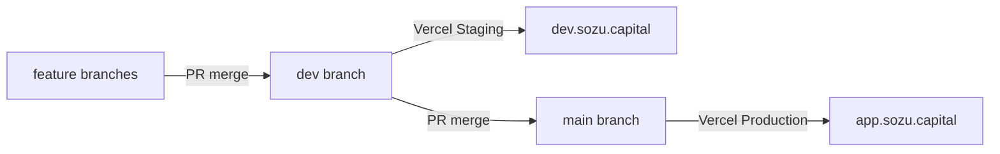

# Deployment guide: Production & Staging

One repo. One Vercel project. Two environments.

## Overview

| Environment | Git branch | Domain | Vercel target |
|-------------|------------|--------|---------------|
| Staging | `dev` | `dev.sozu.capital` | Custom **Staging** env on `sozu-credit` |
| Production | `main` | `app.sozu.capital` | **Production** on `sozu-credit` |
| PR previews | feature PRs | `*.vercel.app` | Preview (passkeys need matching `NEXT_PUBLIC_RP_ID`) |

### Preview build note (Jul 2026)

PR previews were failing TypeScript with `Cannot find namespace 'GeoJSON'` in `components/ui/map.tsx`. Cause: pnpm does not hoist `@types/geojson` from `maplibre-gl`. Fix: declare `@types/geojson` as a direct devDependency. Run `pnpm run build` locally before relying on Vercel Preview.

**Vercel project:** [`sozu-credit`](https://vercel.com/blessedux/sozu-credit) (project ID: `prj_7IxlpyHRoONJP0BpqkyJ7e1jHRDw`)

Both environments point at the **same GitHub repo** (this one). Feature branches merge to `dev` for Staging deployment, then `dev` merges to `main` for Production.

## Promotion chain



See [docs/agents/git-flow.md](./agents/git-flow.md) for agent and developer workflow details.

## Initial Vercel setup

If setting up from scratch:

1. **Create the project:** [vercel.com/new](https://vercel.com/new) → Import this repo → name it `sozu-credit`
2. **Production branch:** Set to `main` (default)
3. **Production domain:** Add `app.sozu.capital` as the primary domain
4. **Create Staging environment:**
   - Dashboard → Settings → Git → Add custom environment: **Staging**
   - Assign branch: `dev`
   - Add domain: `dev.sozu.capital`
5. **Set environment variables** (see section below)

## Environment variables — per-environment differences

These **must** differ between Production and Staging due to passkey origin binding:

### Production (`main` branch → `app.sozu.capital`)

```bash
NEXT_PUBLIC_APP_URL=https://app.sozu.capital
NEXT_PUBLIC_RP_ID=app.sozu.capital
WALLET_CLIENT_DOMAIN=app.sozu.capital
```

### Staging (`dev` branch → `dev.sozu.capital`)

```bash
NEXT_PUBLIC_APP_URL=https://dev.sozu.capital
NEXT_PUBLIC_RP_ID=dev.sozu.capital
WALLET_CLIENT_DOMAIN=dev.sozu.capital
```

### Optional: host-bound callback URLs

If you use Google OAuth or SumUp with fixed redirect URIs, split them per environment:

```bash
# Production
GOOGLE_REDIRECT_URI=https://app.sozu.capital/api/gmail/callback
SUMUP_REDIRECT_URL=https://app.sozu.capital/deposit/return
SUMUP_WEBHOOK_URL=https://app.sozu.capital/api/deposits/sumup/webhook

# Staging
GOOGLE_REDIRECT_URI=https://dev.sozu.capital/api/gmail/callback
SUMUP_REDIRECT_URL=https://dev.sozu.capital/deposit/return
SUMUP_WEBHOOK_URL=https://dev.sozu.capital/api/deposits/sumup/webhook
```

If `GOOGLE_REDIRECT_URI` is unset, the app auto-constructs it from `NEXT_PUBLIC_APP_URL`.

## Environment variables — shared across environments

These can be set on **Production**, **Staging**, and **Preview** with the same values:

```bash
# Supabase
NEXT_PUBLIC_SUPABASE_URL=
NEXT_PUBLIC_SUPABASE_ANON_KEY=
SUPABASE_SERVICE_ROLE_KEY=

# NextAuth
AUTH_SECRET=

# Stellar / Soroban testnet
STELLAR_FUNDER_SECRET=
STELLAR_NETWORK=testnet
SOROBAN_RPC_URL=https://soroban-testnet.stellar.org
SMART_ACCOUNT_FACTORY_ID=
SMART_ACCOUNT_FACTORY_METHOD=create_account
SMART_ACCOUNT_GET_ADDRESS_VIEW=get_address
TESTNET_USDC_CONTRACT_ADDRESS=
CIRCLE_TESTNET_USDC_ISSUER=GBBD47IF6LWK7P7MDEVSCWR7DPUWV3NY3DTQEVFL4NAT4AQH3ZLLFLA5

# OpenZeppelin smart account
OZ_SMART_ACCOUNT_WASM_HASH_TESTNET=
OZ_WEBAUTHN_VERIFIER_CONTRACT_ID_TESTNET=
OZ_THRESHOLD_POLICY_CONTRACT_ID_TESTNET=

# SEP-10 client domain signature
SEP10_CLIENT_SIGNING_SECRET=
WALLET_DOCUMENTATION_URL=https://app.sozu.capital

# SDP wallet integration
SDP_ALLOWED_DOMAINS=
SDP_TENANT_NAME=
SDP_ADMIN_EMAIL=
SDP_ADMIN_PASSWORD=
SDP_ADMIN_API_KEY=
SDP_API_URL=

# Faucet (testnet only)
FAUCET_CONTRACT_ID=
FAUCET_TREASURY_SECRET=
FAUCET_TOKEN_CONTRACT_ID=
FAUCET_USER_COOLDOWN_HOURS=24
FAUCET_GLOBAL_COOLDOWN_MINUTES=
FAUCET_DAILY_LIMIT=
FAUCET_CLAIM_AMOUNT=
FAUCET_HASH_SALT=
NEXT_PUBLIC_DEMO_FAUCET_PATH=/faucet/test-orb-001

# Deposits (CLP bank + SumUp card)
NEXT_PUBLIC_BETA_TIER=closed
DEPOSITS_ENABLED=true
NEXT_PUBLIC_DEPOSITS_ENABLED=true
SOZU_CLP_BANK_NAME=
SOZU_CLP_BANK_ACCOUNT=
SOZU_CLP_BANK_RUT=
SOZU_CLP_BANK_EMAIL=
DEPOSIT_FX_CLP_PER_USDC=950
DEPOSIT_FX_SPREAD_BPS=100
BETA_AUTO_RELEASE_LIMIT_CLP=500000

# SumUp (card deposits)
SUMUP_API_KEY=
SUMUP_MERCHANT_CODE=
SUMUP_WEBHOOK_SECRET=

# Google OAuth (Gmail sync)
GOOGLE_OAUTH_CLIENT_ID=
GOOGLE_OAUTH_CLIENT_SECRET=

# Turnkey (optional HD wallet)
TURNKEY_API_BASE_URL=
TURNKEY_ORGANIZATION_ID=
TURNKEY_API_PUBLIC_KEY=
TURNKEY_API_PRIVATE_KEY=
```

## Passkey constraint (why separate environments matter)

Passkeys are **origin-bound** by the WebAuthn spec. A credential registered on `dev.sozu.capital` cannot be used on `app.sozu.capital`, even though they share the same Supabase user records.

- **Staging users** must register passkeys on `dev.sozu.capital` with `NEXT_PUBLIC_RP_ID=dev.sozu.capital`
- **Production users** must register passkeys on `app.sozu.capital` with `NEXT_PUBLIC_RP_ID=app.sozu.capital`

This is handled automatically via environment-specific `NEXT_PUBLIC_RP_ID` values. If a user needs access on both environments, they must add a passkey per-domain via Settings.

## CLP / USDC live oracle

Deposit quotes use a **live CLP oracle** (`lib/deposits/clp-oracle.ts`):

1. **mindicador.cl** — Chile USD observation (primary)
2. **Frankfurter** (ECB) — fallback when CLP is available
3. **`DEPOSIT_FX_CLP_PER_USDC`** — static fallback if both fail

Optional **`DEPOSIT_FX_SPREAD_BPS`** (default `100` = 1%) is added to spot before quoting USDC.

Preview rate in UI: `GET /api/deposits/fx?amountClp=50000` (no auth).

## SumUp card deposits

Configure SumUp webhook and checkout return URL to match your environment:

- **Production:** `https://app.sozu.capital/api/deposits/sumup/webhook`
- **Staging:** `https://dev.sozu.capital/api/deposits/sumup/webhook` (if testing SumUp on Staging)

**Common 401 causes:**

| Symptom | Fix |
|---------|-----|
| Card checkout fails immediately | `SUMUP_API_KEY` must be **secret** `sup_sk_…`, not public `sup_pk_…` |
| Webhook returns 401 | Remove or fix `SUMUP_WEBHOOK_SECRET` — checkout callbacks often have **no** `x-payload-signature`; leave secret unset and we verify via SumUp API |
| Wrong secret type | `cc_sk_classic_…` is OAuth client secret, not necessarily the webhook HMAC secret |

Probe URL: `GET https://app.sozu.capital/api/deposits/sumup/webhook` → `{ ok: true }`.

## SDP invite links

If using SEP-24 disbursement invites, ensure the SDP allowed client domains include both `app.sozu.capital` and `dev.sozu.capital` (if Staging needs SDP integration). Each domain must publish its own `stellar.toml` with matching `SIGNING_KEY`.

## Local development

To test locally with closed-beta deposit UI:

```bash
# .env.local
NEXT_PUBLIC_APP_URL=http://localhost:3000
NEXT_PUBLIC_RP_ID=localhost
WALLET_CLIENT_DOMAIN=localhost
NEXT_PUBLIC_BETA_TIER=closed
DEPOSITS_ENABLED=true
NEXT_PUBLIC_DEPOSITS_ENABLED=true
DEPOSIT_FX_CLP_PER_USDC=950
SOZU_CLP_BANK_NAME="Sozu Capital SpA"
SOZU_CLP_BANK_ACCOUNT="00-000-00000-00"
SOZU_CLP_BANK_RUT="12.345.678-9"
SOZU_CLP_BANK_EMAIL="depositos@sozu.capital"
```

For ngrok tunneling (needed for SEP-10 client domain signatures and SumUp webhooks), set:

```bash
NEXT_PUBLIC_APP_URL=https://abc123.ngrok-free.app
NEXT_PUBLIC_RP_ID=abc123.ngrok-free.app
WALLET_CLIENT_DOMAIN=abc123.ngrok-free.app
```

## Historical note

Prior to 2026-07-30, Sozu Wallet used two separate Vercel projects:
- `sozu-credit-open` for `credit.sozu.capital` (open beta, deposits disabled)
- `sozu-credit-closed` for `app.sozu.capital` (closed beta, deposits enabled)

The current model consolidates onto a single project (`sozu-credit`) with Staging (`dev` branch → `dev.sozu.capital`) and Production (`main` branch → `app.sozu.capital`) environments. The old two-project model is documented in [docs/deployment-two-domains.md](./deployment-two-domains.md) for reference.
