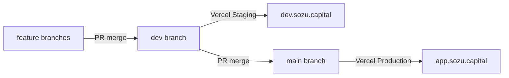

# Deployment guide: Sozu Wallet

One GitHub repo. One Vercel project. Staging + Production (closed beta).

Operator cutover from the legacy two-project setup: **[vercel-consolidation.md](./vercel-consolidation.md)**.

## Overview

| Environment | Git branch | Domain | Vercel target |
|-------------|------------|--------|---------------|
| Staging | `dev` | `dev.sozu.capital` | Custom **Staging** on `sozu-wallet` |
| Production | `main` | `app.sozu.capital` | **Production** on `sozu-wallet` |
| PR previews | feature PRs | `*.vercel.app` | Preview |

**Vercel project:** rename `sozu-credit` → `sozu-wallet`  
**GitHub repo:** rename `blessedux/SozuCredit` → `blessedux/sozu-wallet`



See [agents/git-flow.md](./agents/git-flow.md).

## Closed beta (not a second project)

| Flag | Staging | Production | Purpose |
|------|---------|------------|---------|
| `NEXT_PUBLIC_BETA_TIER` | `closed` | `closed` | Wallet product posture |
| `DEPOSITS_ENABLED` | `true` | `true` | Server deposit APIs |
| `NEXT_PUBLIC_DEPOSITS_ENABLED` | `true` | `true` | Client deposit UI |

Test P2P on/off-ramp on **Staging** (`dev.sozu.capital`). Promote to Production when ready.

Legacy open tier (`credit.sozu.capital`, deposits off) is deprecated — redirect or retire after cutover.

## Environment variables — must differ (passkeys)

### Production (`main` → `app.sozu.capital`)

```bash
NEXT_PUBLIC_APP_URL=https://app.sozu.capital
NEXT_PUBLIC_RP_ID=app.sozu.capital
WALLET_CLIENT_DOMAIN=app.sozu.capital
NEXT_PUBLIC_BETA_TIER=closed
DEPOSITS_ENABLED=true
NEXT_PUBLIC_DEPOSITS_ENABLED=true
```

### Staging (`dev` → `dev.sozu.capital`)

```bash
NEXT_PUBLIC_APP_URL=https://dev.sozu.capital
NEXT_PUBLIC_RP_ID=dev.sozu.capital
WALLET_CLIENT_DOMAIN=dev.sozu.capital
NEXT_PUBLIC_BETA_TIER=closed
DEPOSITS_ENABLED=true
NEXT_PUBLIC_DEPOSITS_ENABLED=true
```

### Optional host-bound callbacks

```bash
# Production
GOOGLE_REDIRECT_URI=https://app.sozu.capital/api/gmail/callback
SUMUP_REDIRECT_URL=https://app.sozu.capital/deposit/return
SUMUP_WEBHOOK_URL=https://app.sozu.capital/api/deposits/sumup/webhook

# Staging
GOOGLE_REDIRECT_URI=https://dev.sozu.capital/api/gmail/callback
SUMUP_REDIRECT_URL=https://dev.sozu.capital/deposit/return
SUMUP_WEBHOOK_URL=https://dev.sozu.capital/api/deposits/sumup/webhook
```

If unset, the app derives callbacks from `NEXT_PUBLIC_APP_URL`.

## Shared secrets (Staging + Production + Preview)

Copy the same values unless you intentionally isolate Staging data (recommended long-term: separate Supabase for Staging).

```bash
NEXT_PUBLIC_SUPABASE_URL=
NEXT_PUBLIC_SUPABASE_ANON_KEY=
SUPABASE_SERVICE_ROLE_KEY=
AUTH_SECRET=

STELLAR_FUNDER_SECRET=
STELLAR_NETWORK=testnet
SOROBAN_RPC_URL=https://soroban-testnet.stellar.org
SMART_ACCOUNT_FACTORY_ID=
SMART_ACCOUNT_FACTORY_METHOD=create_account
SMART_ACCOUNT_GET_ADDRESS_VIEW=get_address
TESTNET_USDC_CONTRACT_ADDRESS=
CIRCLE_TESTNET_USDC_ISSUER=GBBD47IF6LWK7P7MDEVSCWR7DPUWV3NY3DTQEVFL4NAT4AQH3ZLLFLA5

OZ_SMART_ACCOUNT_WASM_HASH_TESTNET=
OZ_WEBAUTHN_VERIFIER_CONTRACT_ID_TESTNET=
OZ_THRESHOLD_POLICY_CONTRACT_ID_TESTNET=

SEP10_CLIENT_SIGNING_SECRET=
WALLET_DOCUMENTATION_URL=https://app.sozu.capital
SDP_ALLOWED_DOMAINS=
SDP_TENANT_NAME=

# Deposits / SumUp (needed where DEPOSITS_ENABLED=true)
SOZU_CLP_BANK_NAME=
SOZU_CLP_BANK_ACCOUNT=
SOZU_CLP_BANK_RUT=
SOZU_CLP_BANK_EMAIL=
DEPOSIT_FX_CLP_PER_USDC=950
DEPOSIT_FX_SPREAD_BPS=100
BETA_AUTO_RELEASE_LIMIT_CLP=500000
SUMUP_API_KEY=
SUMUP_MERCHANT_CODE=
SUMUP_WEBHOOK_SECRET=

# Debug routes: allow on Staging if needed; keep off on Production
ALLOW_DEBUG_ROUTES=false
```

## Passkey constraint

Passkeys are origin-bound. Credentials on `dev.sozu.capital` never work on `app.sozu.capital`. Keep RP ID aligned with the hostname users see.

## Smoke checks

```bash
curl -s https://dev.sozu.capital/api/health | jq .deployment
curl -s https://app.sozu.capital/api/health | jq .deployment
curl -s https://app.sozu.capital/api/deposits/fx | head -c 200
```

`/api/health` reports `betaTier`, `depositsEnabled`, `appUrl`, and `rpId` (no secrets).

## Preview builds

PR previews use Preview env vars. Passkeys on `*.vercel.app` need a matching `NEXT_PUBLIC_RP_ID` or will fail — prefer Staging for auth/deposit QA.

### GeoJSON typecheck note

If typecheck fails on `GeoJSON` in `components/ui/map.tsx`, ensure `types/geojson-namespace.d.ts` is present (pnpm does not hoist `@types/geojson` from maplibre).

## Related

- [vercel-consolidation.md](./vercel-consolidation.md) — cutover + when to delete `sozu-cosed-beta`
- [vercel-migration-runbook.md](./vercel-migration-runbook.md) — dashboard click-path
- [deployment-two-domains.md](./deployment-two-domains.md) — legacy (superseded)
