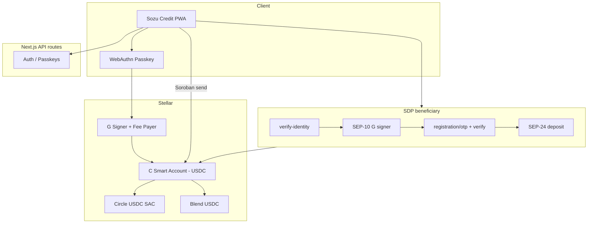

# Sozu Credit — Development log (23 May – 2 June 2026)

**Scope:** All work **committed and pushed** to `main` between **2026-05-23** and **2026-06-02** (69 commits), plus **current local state** as of **2 June 2026**.  
**Purpose:** Single record of updates, architectural decisions, findings, refactors, and UX simplifications during the mobile-wallet and SDP onboarding push.

---

## Executive summary — where we are today

Sozu Credit moved from a **classic Stellar G-wallet + Horizon** model to a **passkey-first, Soroban smart-account (C) wallet** with **OpenZeppelin (OZ) deployment** as the default. Users hold USDC on **C**; sends use **Soroban `transfer`** (Circle SAC or Blend USDC) with **WebAuthn auth** and a **G fee-payer relayer**.

**SDP (beneficiary onboarding)** no longer redirects users to the external SDP UI for registration. The full flow runs in Sozu:

1. **Contact** — org-branded copy; collect **email + date of birth** (verified against SDP records on Sozu).
2. **Passkey** — wallet creation / SEP-10 sign-in using the **passkey-derived G signer** (not the C contract address).
3. **OTP** — SEP-24 interactive deposit OTP + verification **inside Sozu** via new BFF routes.
4. **Done** — fund request submitted; user lands on wallet/home.

**Mobile/PWA** received sustained polish: viewport gaps (`dvh`), persistent session, onboarding, send/deposit modals, ledger shader, transaction history scroll, and build fixes for Vercel.

**DeFindex / yield** — one-click earn, balance race fixes, separate **Circle SAC vs Blend USDC** in audit UI; **in-progress local work** (not yet pushed) refines vault deposit asset selection.

**Latest pushed commit:** `5b669f8` — *Complete SDP registration in Sozu UI without redirecting to SDP.*  
**Unpushed local changes (2 Jun):** DeFindex deposit asset routing, `vault-deposit-asset.ts`, deposit modal simplification, balance audit copy.

---

## Timeline at a glance

| Date | Commits | Dominant themes |
|------|---------|-------------------|
| **2026-05-25** | 1 | SDP wallet onboarding entry, paper shader, ledger polish |
| **2026-05-26** | 5 | Mobile shell, QR scanner, PWA preloader/splash, hydration fixes |
| **2026-05-28** | 1 | Auth gate for `?sdpInvite=1` with existing Supabase session |
| **2026-05-29** | 24 | Wallet switcher, DeFindex one-click yield, SDP Spanish UI, send modal, session persistence, credit/treasury pages |
| **2026-05-30** | 19 | **OZ smart accounts default**, C-wallet unification, balance/Blend USDC, PWA fixes, SDP layout |
| **2026-05-31** | 8 | **OZ passkey Soroban send fix** (`auth_digest`), universal token rail, send/payment refactor |
| **2026-06-01** | 6 | SDP SEP-10 account alignment, passkey signer sync, legacy key derivation |
| **2026-06-02** | 5 | SDP in-app registration (OTP/verify/status), UX simplification, email+DOB on Sozu |

---

## 1. Mobile shell, PWA, and session (25–29 May)

### What shipped

- **Mobile app shell** with bottom navigation, QR scanner, payment flow fixes, profile repair (`d95240c`).
- **PWA assets:** icon, splash, React-managed preloader (fixes hydration crash on mobile) (`a66283d`, `11846b2`).
- **Persistent session** — stay signed in across reloads; Spanish onboarding first slide (`51e02c6`).
- **Wallet switcher modal**, onboarding polish, PWA install banner (`8fc505b`).
- **PWA viewport** — removed bottom black gap on standalone pages; `dvh` on auth/home; iOS gap fixes (`3699977`, `032b181`, `e456c03`, `8256a75`).
- **Settings / onboarding UX** — logout, Android tweaks, ledger shader visibility, swipe + CTA (`c196a0a`, `5551c8f`).
- **Send modal** — transparent background, real-time SozuTag validation, balance alignment (`779c0df`, `1dee0a2`, `7a75f1a`).
- **Receipt sharing**, fiat-style send input, simplified SDP register to **single passkey action** (`db18c93`, `985871c`).

### Insights

- Hydration crashes traced to **imperative DOM preloader** vs React tree — fixed by **React-managed** preloader + `Suspense` around `useSearchParams` (`2b532a3`, `11846b2`).
- **Remotion `video/`** excluded from root `tsconfig` to unblock Vercel builds (`f902f49`).
- Spanish copy and **PWA-first layout** became the default product language for wallet flows.

---

## 2. Architectural pivot: G → C smart account (30 May)

### Decision

New and migrated users use a **Soroban contract account (C)** as the canonical wallet address in Supabase and the tag directory. **G** remains the **passkey-derived signer** and **fee payer**, not the primary balance holder.

Documented in [`smart-account-default-payments.md`](./smart-account-default-payments.md).

### What shipped

| Area | Change |
|------|--------|
| Registration | `ensureSmartWallet()` on passkey register; **block G as primary** (`f78ea1e`) |
| Balance API | Resolve **C** for smart wallets; Horizon paths for legacy G (`7b5946e`, `06f735d`) |
| Payments | Soroban USDC `transfer` default; classic `Operation.payment` legacy fallback (`c65024c`) |
| DB schema | `wallet_type`, `oz_credential_id`, signer columns — SQL in `supabase-stellar-wallet-*.sql` |
| Client session | `client-wallet-session.ts` stores C + credential metadata |
| Tag directory | Shared with Sozu Pay: tags → **C** when provisioned |

### Key modules added or expanded

- `lib/stellar/smart-account-provision.ts`, `smartAccounts/*` (OZ kit, link member, deploy)
- `lib/wallet/unified-usdc-balance.ts`, `sync-canonical-wallet.ts`, `ensure-smart-wallet.ts`
- `components/SmartAccountKitProvider.tsx`
- APIs: `smart-account/provision`, `smart-accounts/register`, `resolve-public-key`

### Finding

**C cannot be the Soroban transaction `source`.** The relayer **G** (`STELLAR_FUNDER_SECRET`) pays fees; **C** authorizes via `__check_auth`. Misconfiguring source as C caused failed sends and confusing balance reads.

---

## 3. OpenZeppelin passkey signing (30–31 May)

### Problem

USDC sends from **C** failed with `Error(Auth, InvalidAction)` / `__check_auth` even with correct `NEXT_PUBLIC_RP_ID=localhost`. Passkey UI succeeded; failure appeared on simulation or submit.

### Root cause (documented in [`fixes/oz-passkey-soroban-send.md`](./fixes/oz-passkey-soroban-send.md))

Testnet OZ WASM `3e51f5b2…` requires:

1. **`AuthPayload`** on credentials with `context_rule_ids` (default deploy → `[0]`) plus signers map — not legacy kit-only shape.
2. WebAuthn signs **`auth_digest`** = `sha256(signature_payload || context_rule_ids_xdr)`, not raw `signature_payload`.

`smart-account-kit@0.2.10` still signed the legacy challenge — wrong for current WASM.

### Fix trajectory (commits)

- Route OZ wallets to WebAuthn, not G ed25519 (`b05c062`)
- Use G signer as tx source, not C (`6c9f045`)
- On-chain `keyData` for Soroban passkey auth (`5de1c8d`, `ea25dc2`)
- `rawId` for OZ keyData (`3b400ff`)
- Align kit WebAuthn flow (`0b5dcdf`)
- **`ozAuthPayload.ts`**, `signSorobanWebAuthnAuth.ts` — auth digest + payload (`044b9c0` area)
- Universal token rail + `send-token.ts` refactor (`044b9c0`)

### Operational lesson

**`NEXT_PUBLIC_RP_ID` must match the hostname used at passkey registration.** Mixing localhost, `:3000`/`:3001`, or ngrok **permanently binds** credentials to that origin. Documented troubleshooting tables in smart-account docs.

### Send path matrix (today)

| `wallet_type` | Condition | Path |
|---------------|-----------|------|
| `oz` | `get_context_rules` succeeds | `oz_passkey` — `kit.signAuthEntry` |
| `oz` | no `get_context_rules` | `oz_passkey_local` — manual WebAuthn |
| `factory` | — | `smart_g_signer` |
| `legacy` | — | Classic payment |

---

## 4. Balances, Blend USDC, Circle SAC, DeFindex (29–30 May)

### User-visible

- **One-click yield** via DeFindex + Blend (`9b693af`).
- Balance card shows **Circle USDC SAC** on C wallets (`503c3e5`).
- **Audit panel** breaks down Blend vs Circle SAC (`4628656`, `5dc4e78`).
- Fixed **$0 stuck balance** after DeFindex fetch race (`696372a`).
- Activation onboarding when wallet needs funding (`needs-activation-onboarding.ts`).

### Technical

- `lib/stellar/soroban-token.ts` — hardened balance reads for C holders.
- `lib/wallet/unified-usdc-balance.ts` — aggregates spendable USDC across contracts.
- Env: `TESTNET_USDC_CONTRACT_ADDRESS` (Blend), `TESTNET_CIRCLE_USDC_SAC_CONTRACT_ADDRESS` (receive default).
- Docs: [`wallet-stellar-defindex.md`](./wallet-stellar-defindex.md), [`obtain-blend-usdc-testnet.md`](./obtain-blend-usdc-testnet.md).

### Universal Token Rail (31 May)

Principle: assets identified by **`contractId`**, not ticker alone.

New modules: `asset-registry.ts`, `send-token.ts`, `pick-send-token.ts`, `token-balances.ts`, `blend-pool-reserves.ts`.  
Payment API accepts optional `contractId`; balance API returns `tokenBalances[]`.  
See [`architecture/universal-token-rail.md`](./architecture/universal-token-rail.md).

---

## 5. SDP beneficiary onboarding (25 May – 2 June)

### Evolution

| Phase | Behavior |
|-------|----------|
| Early (25–29 May) | SDP invite → register UI; Spanish copy; tenant headers; verify name+DOB before passkey |
| 30 May | Tablet/desktop layout; `resolveSep10Account`; SDP context API |
| 1 Jun | SEP-10 must use **passkey G**, not C; sync signer to DB before signing; legacy IndexedDB key derivation |
| 2 Jun | **Full in-app SEP-24 registration**; email+DOB on Sozu; no SDP redirect |

### Current flow (`SdpRegisterFlow.tsx`)

```
contact (email + DOB → POST /api/sdp/verify-identity)
    → passkey (SEP-10 + wallet provision)
    → otp (POST /api/sdp/registration/otp + verify)
    → done (SEP-24 deposit / fund request)
```

Steps persisted via invite payload + cookies (`lib/sdp/persistInvite.ts`, `jwtCookie.ts`).

### New server routes (2 Jun)

| Route | Role |
|-------|------|
| `POST /api/sdp/registration/otp` | Proxy SEP-24 OTP send |
| `POST /api/sdp/registration/verify` | OTP + verification field (DOB) |
| `GET /api/sdp/registration/status` | Registration status poll |
| `POST /api/sdp/verify-identity` | Email+DOB check before passkey |
| `GET /api/sdp/context` | Org name, step, testnet flag |

### Core libraries

| Module | Role |
|--------|------|
| `sep24Registration.ts` | Server-side SEP-24 interactive deposit API |
| `sep24Session.ts` | JWT cookie + interactive deposit base URL |
| `requireRegistrationSession.ts` | Guard OTP routes (needs SEP-24 JWT + verified contact) |
| `resolveSep10Account.ts` | SEP-10 account id = passkey **G** signer |
| `sep10ClientAccount.ts` | Client-side SEP-10 account resolution |
| `beneficiaryIdentity.ts` | Identity fields for SDP |
| `sdpApiContext.ts` | Tenant + invite context |
| `ensure-passkey-signer.ts` | Align DB signer with passkey-derived G |
| `sync-signer` API | Persist signer before SEP-10 |

### Critical findings

1. **SEP-24 `account` must match SEP-10 JWT account** — mismatch caused OTP verification failures (`3cc4eb8`).
2. **SEP-10 challenge account must be G (signer), not C (contract)** — fund request signing failed when session stored C (`f31daf4`, `6cc1839`).
3. **`SDP-Tenant-Name` header** required on all SDP API calls (`ab381bf`).
4. **`WALLET_CLIENT_DOMAIN`** derived from `NEXT_PUBLIC_APP_URL` when unset (`b0eda1f`).
5. **Passkey-only sessions** need `x-user-id` / `x-stellar-public-key` on register (`167b681`, `fef3ed5`).
6. Production E2E: document **`SDP_ALLOWED_DOMAINS`** on Railway (`81d9168`).

### UX simplification (2 Jun)

- **Org-branded** titles: “Recibir pago de {org}” (`displayName.ts`).
- **Email before passkey** — reduces abandoned passkey prompts when identity fails.
- Removed redirect to external SDP for registration (`5b669f8`).
- Optional **debug panel** (dev): `sep24_account`, `signer_G`, `wallet_C`, `tx_id`.

---

## 6. Payments, send UX, and wallet screen (29–31 May)

### Refactors

- `hooks/use-send-payment.ts` — large rewrite for Soroban paths, recipient resolution, error codes.
- `lib/wallet/align-send-wallet.ts`, `deposit-receive-address.ts` — canonical C for send/deposit.
- `send-payment-modal.tsx` — SozuTag resolution, balance display, haptics.
- `transaction-history.tsx` — mobile scroll, layout (`c01893c`).
- `deposit-modal.tsx` — receive address = C, copy UX.
- Post-passkey **redirect loop to `/auth`** fixed (`54d047a`).

### APIs

- `POST /api/wallet/stellar/payment` — Soroban + legacy; structured error codes (`SOROBAN_SIM_AUTH_FAILED`, etc.).
- `GET /api/wallet/resolve-recipient` — tags → C or G.
- `GET /api/wallet/stellar/assets` — asset catalog per holder.

---

## 7. Product surfaces beyond wallet (29 May)

- **Credit page**, treasury UX, bilingual wallet polish (`985871c`).
- **Privacy wallet roadmap** Phases 1–10 (`privacy-wallet-roadmap.md`).
- **Credit marketplace roadmap** — MUJERES 2000 campaign narrative (`credit-marketplace-roadmap.md`).
- **Docs index** [`docs/README.md`](./README.md) — reading order for new developers.

---

## 8. Build, auth, and infrastructure fixes

| Issue | Fix |
|-------|-----|
| Vercel TS errors on Soroban simulation types | Narrow types in simulation helpers (`9413f3f`) |
| Duplicate `normalizeCredentialId` import | Remove duplicate (`b2d1055`) |
| `clearClientSession` in non-async component | Static import (`c4ff146`) |
| `useSearchParams` without Suspense | Wrap `MobileAppShell` (`2b532a3`) |
| Profile mutations wrong Supabase client | In-scope service client (`d98f0b1`) |
| `/auth?sdpInvite=1` blocked when session exists | Auth page allowlist (`46743fe`) |

---

## 9. Documentation created or materially updated

| Document | Content |
|----------|---------|
| [`smart-account-default-payments.md`](./smart-account-default-payments.md) | C default, send paths, env, troubleshooting |
| [`smart-account-signer-migration.md`](./smart-account-signer-migration.md) | Signer migration, rpID |
| [`fixes/oz-passkey-soroban-send.md`](./fixes/oz-passkey-soroban-send.md) | Auth digest root cause + verify steps |
| [`architecture/universal-token-rail.md`](./architecture/universal-token-rail.md) | contractId-first assets |
| [`privacy-wallet-roadmap.md`](./privacy-wallet-roadmap.md) | Long-term privacy stack |
| [`credit-marketplace-roadmap.md`](./credit-marketplace-roadmap.md) | Credit marketplace vision |
| [`wallet-stellar-defindex.md`](./wallet-stellar-defindex.md) | DeFindex env, endpoints, mainnet checklist |
| [`obtain-blend-usdc-testnet.md`](./obtain-blend-usdc-testnet.md) | Testnet Blend USDC funding |
| [`supabase-stellar-wallet-signer.sql`](./supabase-stellar-wallet-signer.sql) | Factory signer schema |
| [`supabase-stellar-wallet-oz.sql`](./supabase-stellar-wallet-oz.sql) | OZ columns |

---

## 10. Current state (2 June 2026)

### Production branch (`main` @ `5b669f8`)

- Passkey + **OZ C-wallet** is the default path for new users.
- Sends work on testnet with **auth_digest** signing for current OZ WASM.
- Balances aggregate **Circle SAC + Blend USDC** (and DeFindex positions separately).
- SDP beneficiaries complete **contact → passkey → OTP → done** entirely in Sozu.
- Mobile PWA is usable on iOS/Android with session persistence and polished send/deposit/history.

### Local work not yet pushed

Touches **DeFindex vault deposit asset** selection (Blend vs Circle for earn deposits):

- New: `lib/defindex/vault-deposit-asset.ts`
- Updated: `lib/defindex/vault.ts`, `auto-deposit.ts`, `config.ts`, `strategy-catalog.ts`
- API: `app/api/wallet/defindex/deposit/route.ts`
- UI: `deposit-modal.tsx` simplified; `balance-audit-panel.tsx` copy
- Docs: `wallet-stellar-defindex.md` expanded
- Script: `scripts/test-defi-e2e.ts`

**Intent:** DeFindex vault deposits should use the contract the vault/strategy expects (often **Blend USDC**), while **receive** may still default to **Circle SAC** — avoiding deposit failures from wrong SAC.

### Recommended verification checklist

- [ ] New user: passkey register → C provisioned → Circle SAC faucet → send to another C/G
- [ ] Existing legacy G user: migration path or legacy send notice
- [ ] SDP E2E: invite link → email/DOB → passkey → OTP → fund request visible in SDP
- [ ] `NEXT_PUBLIC_APP_URL` + `NEXT_PUBLIC_RP_ID` aligned on deployed domain
- [ ] DeFindex: `GET /api/test/auto-deposit-e2e?strategyId=fixed` after pushing deposit-asset changes
- [ ] Railway SDP: `SDP_ALLOWED_DOMAINS` includes production app host

---

## 11. Commit index (chronological, newest first)

<details>
<summary>All 69 commits (click to expand)</summary>

```
5b669f8 2026-06-02 Complete SDP registration in Sozu UI without redirecting to SDP.
f049e50 2026-06-02 Fix SDP verification: require email+DOB on Sozu, default SEP-24 to C account.
df206d2 2026-06-02 Simplify SDP flow: org-branded copy, email before passkey.
3cc4eb8 2026-06-02 Fix SDP OTP verification by aligning SEP-24 account with SEP-10 JWT.
f31daf4 2026-06-02 Fix SDP fund request by signing SEP-10 with the user wallet G.
fee087e 2026-06-01 Fix legacy passkey key derivation for existing SDP wallets.
2e00b3b 2026-06-01 Fix SDP signing for existing wallets with registered G signer.
b83e5bd 2026-06-01 Fix SEP-10 challenge account to match passkey-derived signer.
c249850 2026-06-01 Sync DB signer to passkey-derived G before SDP SEP-10 signing.
560b660 2026-06-01 Fix SDP signing when credential_id or IndexedDB G key is missing.
6cc1839 2026-06-01 Fix SDP passkey signing when session stores smart account C address.
044b9c0 2026-05-31 Fix passkey Soroban sends and payment UI flow.
0b5dcdf 2026-05-31 Align Soroban passkey signing with smart-account-kit WebAuthn flow.
9413f3f 2026-05-31 Fix Soroban simulation type checks for Vercel TypeScript build.
b2d1055 2026-05-31 Fix duplicate normalizeCredentialId import breaking Vercel build.
26136e0 2026-05-31 Fix legacy smart wallet sends using on-chain signer keyData.
3b400ff 2026-05-31 Fix OZ passkey keyData to use WebAuthn assertion rawId.
a2c12f9 2026-05-31 Route wallets without get_context_rules away from OZ kit signing.
5de1c8d 2026-05-31 Use on-chain signer keyData for Soroban passkey auth.
ea25dc2 2026-05-30 Fix passkey public key parsing and single WebAuthn send prompt.
b05c062 2026-05-30 Route OZ passkey wallets to WebAuthn auth, not G ed25519.
2358cc7 2026-05-30 Fix factory smart wallet sends without get_context_rules.
6c9f045 2026-05-30 Fix Soroban sends: use G signer as tx source, not C contract
06f735d 2026-05-30 Fix 500 on balance API for C smart accounts (Horizon)
4628656 2026-05-30 Harden Soroban balance reads and audit breakdown for Blend vs Circle SAC
696372a 2026-05-30 Fix balance card stuck at $0 after DeFindex fetch race
503c3e5 2026-05-30 Show Circle USDC SAC balance on C wallets in the balance card.
5dc4e78 2026-05-30 Fix C-wallet BlendUSDC balance reads and polish mobile wallet UX.
54d047a 2026-05-30 Fix post-passkey redirect loop to /auth.
c01893c 2026-05-30 Improve mobile UX: history scroll, deposit modal, ledger background.
f78ea1e 2026-05-30 Provision C smart wallet on registration and block G as primary.
7b5946e 2026-05-30 Unify wallet on C smart account for balance and Soroban sends.
41cc3af 2026-05-30 Fix SDP registration UX and auth layout for tablet/desktop.
c65024c 2026-05-30 feat(wallet): OpenZeppelin smart accounts and Soroban USDC payments by default.
8256a75 2026-05-30 Fix iOS PWA viewport gap, Spanish auth defaults, and payment address handling.
3699977 2026-05-30 fix(pwa): remove bottom black gap across all standalone pages.
e456c03 2026-05-30 fix(pwa): resolve mobile viewport gap and improve send modal UX.
032b181 2026-05-30 fix(pwa): tighten mobile viewport layout on auth and home.
7a75f1a 2026-05-29 fix(send): align payment modal UX and improve Sozu tag resolution.
a0664fe 2026-05-29 fix(send): left-align balance in modal to match balance card position
779c0df 2026-05-29 feat(send): transparent modal bg + real-time SozuTag validation
1dee0a2 2026-05-29 fix: remove legacy create-wallet buttons, Spanish PWA copy, ledger shader, PWA gap
5551c8f 2026-05-29 fix: settings shader visible, PWA bottom gap (dvh), install banner toast
c196a0a 2026-05-29 fix: settings logout, Android UI, PWA gap, onboarding swipe + CTA
c4ff146 2026-05-29 fix(build): use static import for clearClientSession in profile-sheet
2b532a3 2026-05-29 feat(session): persistent session + fix Spanish onboarding first slide
51e02c6 2026-05-29 fix(build): wrap MobileAppShell in Suspense
f902f49 2026-05-29 fix(build): exclude video/ subfolder from root tsconfig
8fc505b 2026-05-29 feat(wallet): wallet switcher modal, onboarding polish, PWA install
9b693af 2026-05-29 feat(defi): one-click yield earning via DeFindex + Blend integration
520f833 2026-05-29 feat(wallet): improve balance display and add haptics dependency
b768e05 2026-05-29 feat(sdp): verify beneficiary name and DOB before passkey fund request
81d9168 2026-05-29 docs(sdp): document Railway SDP_ALLOWED_DOMAINS for production E2E
a9bc8bf 2026-05-29 feat(sdp): Spanish register UI, tenant redirect fix, passkey CTA styling
a85e5c6 2026-05-29 fix: sign with client-domain key before verifyChallengeTxSigners
ab381bf 2026-05-29 fix: pass SDP-Tenant-Name header on all SDP API calls
b0eda1f 2026-05-29 fix: derive WALLET_CLIENT_DOMAIN from NEXT_PUBLIC_APP_URL
fef3ed5 2026-05-29 fix(register): x-stellar-public-key header fallback
167b681 2026-05-29 fix(register): send x-user-id header for passkey-only sessions
db18c93 2026-05-29 feat: receipt sharing, fiat send input, and SDP register polish
92ac401 2026-05-29 fix(register): simplify /sdp/register to single passkey action
985871c 2026-05-29 feat: credit page, treasury UX, and bilingual wallet polish
46743fe 2026-05-28 fix(auth): allow /auth?sdpInvite=1 when Supabase session exists
11846b2 2026-05-26 fix: proper React-managed preloader
9cfb4d9 2026-05-26 fix: hydration crash after auth and QR scan
a66283d 2026-05-26 feat: PWA icon, splash screen, and app preloader
d98f0b1 2026-05-26 fix: in-scope service client for profile mutations
d95240c 2026-05-26 feat: mobile shell, QR scanner, payment fixes, profile repair
0df2ccb 2026-05-25 Add SDP wallet onboarding, persistent paper shader background, and ledger polish.
```

</details>

---

## 12. Architecture diagram (today)



---

## Related reading

- [docs/README.md](./README.md) — doc index  
- [project-history.md](./project-history.md) — short milestone bullets  
- Git forensic detail: `git log --since=2026-05-23 --oneline`

---

*Generated from repository history on 2026-06-02. Update this file when the next major milestone closes (e.g. DeFindex deposit-asset push, mainnet rotation).*
