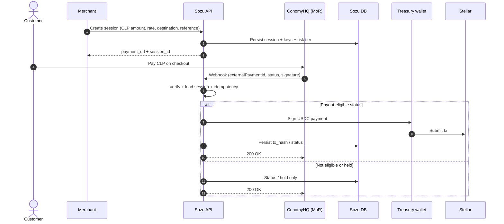

# Payments and settlement (fiat → USDC)

Operational reference for fiat settlement on Stellar and partner-specific flows.

---

## Fiat-to-USDC settlement API

How the fiat-to-USDC settlement works in the API, how we achieve sub-second commitment to settlement, and how merchants get a cart ready to receive money in under five minutes.

### Overview

- **Merchant** creates a payment session (cart) with amount, currency, conversion rate, and the Stellar address that will receive USDC.
- **Customer** pays in fiat via our licensed partner (card or bank); the partner sends us a webhook when payment is confirmed.
- **We** convert at the agreed rate and send USDC on Stellar to the merchant’s address. We act as processor/escrow; we do not integrate directly with Visa/Mastercard.

Core logic lives in **[`lib/payment-rail/fiat-to-usdc-flow.ts`](../lib/payment-rail/fiat-to-usdc-flow.ts)** (types, conversion, webhook → settlement instruction).

### How the API works (step by step)

**Merchant: create a payment session**

- Amount in fiat (minor units)
- Currency (e.g. USD, ARS)
- Conversion rate locked for the session
- Destination Stellar public key (G…)
- Optional reference / memo

The API validates, persists a session with idempotency data, and returns a payment link or session id.

**Customer** completes fiat payment on the partner’s hosted flow.

**Partner webhook** includes external payment id (idempotency), amount/currency, reference/session id, and status. Settlement runs only on eligible statuses (e.g. completed/captured).

**Our handler** verifies the webhook, loads the session, computes settlement via `webhookToSettlementInstruction`, enforces idempotency on `externalPaymentId`, submits USDC from the platform wallet, persists tx metadata, and returns 200. Submission is targeted in **under ~1s**; ledger confirmation follows shortly after.

### Fast settlement (design choices)

- Minimal round-trips on the hot path (session read → convert → idempotency → submit).
- Pre-funded treasury USDC (no waiting on partner to deliver crypto).
- Respond after submit, not after full Stellar finality.
- Idempotency keyed by partner `externalPaymentId`.

### Merchant onboarding (< 5 minutes to first link)

1. Register / API key.
2. Default Stellar destination (optional per session override).
3. `POST` create session → share payment URL.

### API surface (summary)

| Purpose | Route |
|--------|--------|
| Create session | `POST /api/payment-rail/sessions` |
| Partner webhook | `POST /api/payment-rail/webhooks/:partner` |
| Session status | `GET /api/payment-rail/sessions/:id` |

---

## ConomyHQ (CLP) → USDC — Merchant-of-Record flow

ConomyHQ acts as **Merchant-of-Record** for CLP collection; Sozu orchestrates sessions and settles **USDC on Stellar** after authoritative webhooks.

### Roles

- **Customer**: pays CLP via Conomy.
- **ConomyHQ (MoR)**: collects CLP, compliance, lifecycle webhooks.
- **Sozu**: session storage, webhook verification, idempotency/risk, Stellar payout from treasury.
- **Merchant**: receives USDC at a Stellar address.

### Sequence (mermaid)

### Safety notes

- Treat Conomy’s webhook as authoritative for lifecycle transitions.
- Only settle when status matches your risk policy for finality.
- Plan for reversals (chargebacks/refunds) and merchant reserves.

### References

- [`lib/payment-rail/fiat-to-usdc-flow.ts`](../lib/payment-rail/fiat-to-usdc-flow.ts)
