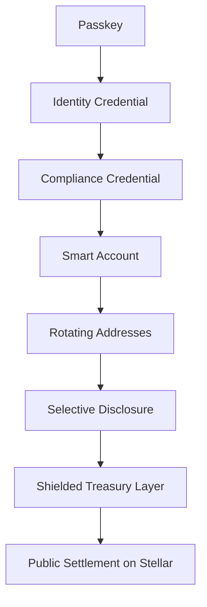

# Sozu Privacy Wallet — Product Roadmap

**Status:** Strategic reference · **Timeline:** Phased (1 → 10)  
**Scope:** Cross-cutting vision for Sozu Credit (consumer wallet), Sozu Pay Dashboard (NGO/enterprise control plane), and on-chain privacy infrastructure.

This document is the canonical **privacy + compliance stack** roadmap. It complements the credit-product phases in the root [README](../README.md#-roadmap) (DeFi, education, community credit) and the NGO ecosystem plan in [SozuPay_dashboard](https://github.com/blessedux/SozuPay_dashboard) (`docs/00-overview/roadmap.md`).

---

## Vision

Build the most private, compliant, self-custodial financial operating system in Latin America.

| Goal | Meaning |
|------|---------|
| **Self-custody** | Users and orgs control signing keys; Sozu does not hold funds or unilateral signing power. |
| **Passkey UX** | WebAuthn replaces passwords and seed phrases for day-to-day access. |
| **Enterprise privacy** | Org flows (payroll, treasury, suppliers) are not reconstructible from public ledger data alone. |
| **Regulatory compliance** | Authorized parties can audit when legally required. |
| **Institutional-grade auditability** | Selective disclosure and credential-based proofs, not full account dumps. |
| **Public blockchain settlement** | Final settlement on Stellar (classic + Soroban); privacy layers sit above public rails where appropriate. |

---

## Ecosystem placement

| Repo | Role in this roadmap |
|------|----------------------|
| **Sozu Credit** (this repo) | Consumer/recipient wallet: passkeys, smart account (C), USDC send/receive, SDP registration, DeFi yield, community credit. |
| **SozuPay Dashboard** | Staff/org control plane: disbursements, org treasury, member smart accounts, batch payouts, compliance ops. |
| **sozu_capital_privacy_protocol** | ZK + confidential contracts (Phases 6–9 deep privacy): payroll batches, shielded notes, verifier circuits. |

Shared infrastructure: Supabase tag directory (`profiles.username` → wallet addresses), OpenZeppelin smart accounts — see [smart-account-default-payments.md](./smart-account-default-payments.md).

---

## Phase overview

| Phase | Name | Objective |
|-------|------|-----------|
| **1** | Self-custodial foundation | Send/receive without seed phrases |
| **2** | Account recovery | Eliminate seed phrase dependency |
| **3** | Identity layer | Identity without public exposure |
| **4** | Compliance credentials | AML/sanctions/risk without revealing PII on-chain |
| **5** | Rotating smart accounts | Reduce public traceability |
| **6** | Selective disclosure | Auditor/regulator/lender proofs |
| **7** | Enterprise privacy layer | Departmental wallets and segmented treasury |
| **8** | Zero-knowledge compliance | Prove policy without revealing identity |
| **9** | Shielded treasury pools | Private balances/positions with auditable ownership |
| **10** | Compliance-preserving privacy | Full stacked architecture |

---

## Phase 1 — Self-custodial foundation

**Timeline:** Current

### Deliverables

- Passkey authentication
- Smart accounts
- Contract-based wallets
- Universal token rail
- Relayer infrastructure
- Account abstraction

### Success criteria

Users can **send and receive assets without seed phrases**.

### Sozu Credit status

| Deliverable | Status | Notes |
|-------------|--------|--------|
| Passkey authentication | ✅ Shipped | [authentication-and-accounts.md](./authentication-and-accounts.md) |
| Smart accounts (C) | 🚧 In progress | OZ `smart-account-kit` + factory fallback — [smart-account-default-payments.md](./smart-account-default-payments.md), [smart-account-signer-migration.md](./smart-account-signer-migration.md) |
| Contract-based wallets | 🚧 Partial | Soroban USDC `transfer` from C; legacy G fallback |
| Universal token rail | 📅 Planned | USDC-first; multi-asset later |
| Relayer / fee sponsorship | 📅 Planned | G signer pays fees today; no dedicated relayer service |
| Account abstraction | 🚧 Partial | Passkey-signed Soroban auth paths; not all flows abstracted |

**Related:** [architecture-and-platform.md](./architecture-and-platform.md), [wallet-stellar-defindex.md](./wallet-stellar-defindex.md), SDP flows in SozuPay `docs/04-integrations/sdp-passkey-noncustodial-wallet.md`.

---

## Phase 2 — Account recovery

**Objective:** Eliminate seed phrase dependency.

### Recovery guardians

User selects trusted parties (e.g. family, business partner, lawyer, accountant).

**Threshold example:** `3-of-5` approvals required to initiate recovery.

### Recovery passkeys

Multiple devices supported simultaneously:

- Phone
- Laptop
- Tablet

(Platform passkey sync — iCloud Keychain / Google Password Manager — is the near-term primary path.)

### Emergency recovery delay

**Example:** `7-day` recovery window before ownership transfer completes, allowing fraud detection and user notification.

### Sozu Credit status

| Method | Status |
|--------|--------|
| Multi-device passkeys | 📅 Extend `passkeys` table + UX |
| Guardian threshold on smart account | 📅 Contract policy (OZ threshold or custom) |
| Cooling-off / delay | 📅 Not implemented |
| NGO-assisted rotation | 📅 Documented in SozuPay `wallet-recovery-plan.md` |

**Related:** SozuPay [SEP-30 integration plan](https://github.com/blessedux/SozuPay_dashboard/blob/main/docs/03-planning/sep-30-integration-plan.md) (Stellar recovery servers, later stage).

---

## Phase 3 — Identity layer

**Objective:** Identity without public exposure.

| Off-chain (stored by Sozu / partner) | On-chain (public ledger) |
|--------------------------------------|----------------------------|
| KYC documents | `Verified Credential` claim only |
| Company records | |
| Compliance filings | |

No raw PII on Stellar; chain sees attestation status, not documents.

### Sozu Credit status

📅 **Planned** — Product README historically emphasized “no KYC” for community credit; institutional and enterprise flows will need a separate **verified** tier without changing the public vouching model for everyone.

---

## Phase 4 — Compliance credentials

**Objective:** Prove policy compliance without revealing personal data.

### Implement

- AML screening
- Sanctions screening
- Risk scoring

### Generate

On-chain or verifiable off-chain: **`Compliance Credential`**

Users prove:

- ✓ Verified
- ✓ Not sanctioned
- ✓ Allowed to transact

Without revealing name, address, RUT, or company structure on the public ledger.

### Sozu Credit status

📅 **Greenfield** — Issuer service + credential schema + Stellar/Soroban binding. SozuPay [phase-privy-wallet-kyc](https://github.com/blessedux/SozuPay_dashboard/blob/main/docs/07-reference/phase-privy-wallet-kyc.md) (Persona) is a prior art reference for dashboard KYC, not this credential model.

---

## Phase 5 — Rotating smart accounts

**Objective:** Reduce public traceability.

Each user/org receives logical wallets (examples):

| Wallet role | Purpose |
|-------------|---------|
| Treasury | Reserves |
| Operating | Day-to-day spend |
| Payroll | Salaries |
| Lending | Credit lines |
| Merchant | Acceptance |

**Addresses rotate automatically**; identity linkage stays private off-chain.

### Sozu Credit status

📅 **Planned** — Today: single primary C per user; SozuPay separates org disbursement contract vs treasury SA (partial segmentation).

---

## Phase 6 — Selective disclosure

**Objective:** Reveal only what is necessary to authorized parties.

| Audience | Example proofs |
|----------|----------------|
| Auditor | Proof of reserves |
| Regulator | Jurisdiction + policy compliance |
| Lender | Proof of income, scoped transaction history |

Full account activity is not exported by default.

### Sozu Credit status

📅 **Planned** — Implementation aligns with [sozu_capital_privacy_protocol](https://github.com/sozu-capital/sozu_capital_privacy_protocol) viewing keys and payroll issuer model.

---

## Phase 7 — Enterprise privacy layer

**Objective:** Organizations operate without public observers reconstructing payroll, suppliers, or org structure.

### Capabilities

- Departmental wallets
- Treasury segmentation
- Internal accounting layers

**Auditors** retain visibility via Phase 6; **public observers** do not.

### Sozu Credit status

📅 **Planned** — Primary build surface is SozuPay Dashboard (org treasury, disbursement contract, member SAs). Sozu Credit remains the end-user/recipient surface.

---

## Phase 8 — Zero-knowledge compliance

Users prove:

- ✓ KYC passed
- ✓ AML passed
- ✓ Jurisdiction allowed
- ✓ Balance threshold met

Without revealing:

- ✗ Name
- ✗ Address
- ✗ RUT (tax ID)
- ✗ Company structure

### Sozu Credit status

📅 **Research / protocol** — Circuits and verifier contracts in `sozu_capital_privacy_protocol`; wallet UX consumes attestations from Phase 4.

---

## Phase 9 — Shielded treasury pools

**Target:** Treasury management (not anonymous retail transfers).

### Use cases

- Cash management
- Enterprise reserves
- Yield strategies

### Properties

- Private balances
- Private positions
- Auditable ownership

**Not intended for** anonymous peer-to-peer transfers.

### Sozu Credit status

📅 **Planned** — Overlaps DeFi vault work ([wallet-stellar-defindex.md](./wallet-stellar-defindex.md)) with confidential balance layer from privacy protocol.

---

## Phase 10 — Final architecture

Stack order (compliance-preserving privacy):

---

## Core principle

**Privacy is not anonymity.**

| Privacy means | Compliance means |
|---------------|------------------|
| Protecting users and organizations from **unnecessary exposure** | Allowing **authorized auditability** when legally required |

Sozu optimizes for **both** simultaneously: minimize public leakage by default; enable provable, scoped disclosure for regulators, auditors, and counterparties when required.

---

## Document maintenance

| Version | Date | Change |
|---------|------|--------|
| 1.0 | 2026-05-31 | Initial canonical doc from product strategy; linked from README and architecture guide. |

When a phase ships in Sozu Credit, update the **Sozu Credit status** tables above and add a dated bullet to [project-history.md](./project-history.md).
