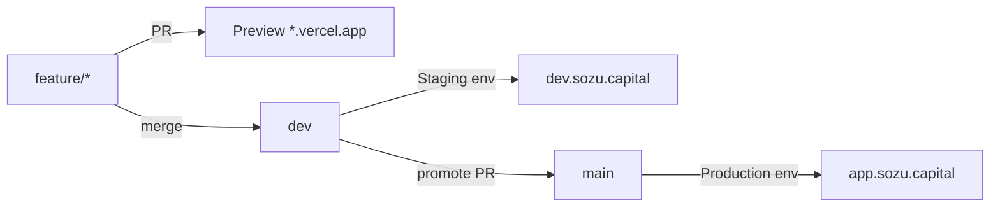

# Vercel consolidation: Sozu Wallet (one repo, one project)

**Status:** Ready for operator cutover  
**Goal:** Stop using a second Vercel project for closed-beta P2P ramps. Run Staging + Production (closed beta) from one GitHub repo and one Vercel project.

## Current state (as of 2026-07-31)

| Surface | Serves | Notes |
|---------|--------|-------|
| Vercel `sozu-cosed-beta` (typo’d name) | **`app.sozu.capital`** (live, deposits on) | Separate project wired to this same GitHub repo |
| Vercel `sozu-credit` | **`credit.sozu.capital`** (live, deposits off) + Preview | Open-beta / wallet-only posture |
| `dev.sozu.capital` | **404** | Staging not configured yet |
| GitHub `blessedux/SozuCredit` | Source for both projects | Rename target: `sozu-wallet` |

**Do not delete `sozu-cosed-beta` first.** It currently owns production traffic for `app.sozu.capital`. Deleting it without transferring the domain takes down closed-beta prod.

## Target architecture (best practice)



| Environment | Git branch | Domain | Role |
|-------------|------------|--------|------|
| Preview | PR branches | `*.vercel.app` | Ephemeral review (passkeys fragile unless RP ID matches) |
| Staging | `dev` | `dev.sozu.capital` | Safe place to test deposits / P2P on-off ramp |
| Production | `main` | `app.sozu.capital` | Closed-beta Sozu Wallet (deposits on) |

**Closed beta is not a separate Vercel project.** It is Production on `app.sozu.capital` with:

- `NEXT_PUBLIC_BETA_TIER=closed`
- `DEPOSITS_ENABLED=true` / `NEXT_PUBLIC_DEPOSITS_ENABLED=true`

Staging uses the same flags so deposit rails can be tested without touching Production.

**One Vercel project** (rename `sozu-credit` → `sozu-wallet`).  
**One GitHub repo** (rename `SozuCredit` → `sozu-wallet`).

Legacy `credit.sozu.capital` / open tier: redirect to `app.sozu.capital` or retire after cutover.

## Why this replaces the second project

| Old practice | Problem | New practice |
|--------------|---------|--------------|
| `sozu-cosed-beta` project for deposits | Duplicate deploys, naming drift, double Preview noise | Feature flags on Staging + Production |
| Test P2P “only on closed project” | Same codebase, worse ops | Test on Staging (`dev.sozu.capital`) |
| Two production domains with shared Supabase | Passkeys don’t cross origins; support confusion | One prod domain: `app.sozu.capital` |

## Safe cutover order

### Phase A — Prepare (no downtime)

1. **Rename GitHub repo** (Settings → General → Repository name): `SozuCredit` → `sozu-wallet`  
   - GitHub redirects old URLs; update local remotes:  
     `git remote set-url origin https://github.com/blessedux/sozu-wallet.git`
2. **Rename Vercel project** `sozu-credit` → `sozu-wallet` (Project Settings → General).  
   - Confirm Git integration still points at the renamed GitHub repo.
3. On **`sozu-wallet`** (formerly `sozu-credit`):
   - Production branch = `main`
   - Create custom environment **Staging** → branch `dev`
   - Add domain `dev.sozu.capital` → Staging
   - Set Staging env vars (see [deployment.md](./deployment.md)): URL / RP ID / client domain for `dev.sozu.capital`, deposits **on**
   - Set Production env vars for `app.sozu.capital` (may still be on the other project — prepare values now)
4. Smoke-test Staging only: https://dev.sozu.capital/api/health  
   Expect `deployment.betaTier: "closed"`, `depositsEnabled: true`.

### Phase B — Move Production domain (brief DNS window)

1. In **`sozu-cosed-beta`**: Settings → Domains → remove `app.sozu.capital`
2. In **`sozu-wallet`**: Settings → Domains → add `app.sozu.capital` → **Production**
3. Ensure Production env on `sozu-wallet` has:
   - `NEXT_PUBLIC_APP_URL=https://app.sozu.capital`
   - `NEXT_PUBLIC_RP_ID=app.sozu.capital`
   - `WALLET_CLIENT_DOMAIN=app.sozu.capital`
   - `NEXT_PUBLIC_BETA_TIER=closed`
   - `DEPOSITS_ENABLED=true` + `NEXT_PUBLIC_DEPOSITS_ENABLED=true`
   - SumUp / bank / shared secrets copied from the closed-beta project
4. Redeploy Production (`main`)
5. Smoke test Production:

```bash
curl -s https://app.sozu.capital/api/health | jq .
curl -s https://app.sozu.capital/api/deposits/fx | head -c 200
```

Expect health `ok`, deposits FX quote (not “Deposits not available”).

6. Passkey check: existing `app.sozu.capital` passkeys keep working **only if** RP ID stays `app.sozu.capital` (same origin). Do not change the hostname during cutover.

### Phase C — Soak, then delete closed-beta project

Wait **24–48 hours** with Production stable on `sozu-wallet`.

Then:

1. Disconnect Git from `sozu-cosed-beta` (stop double Preview checks on PRs)
2. Delete or archive **`sozu-cosed-beta`** / `sozu-credit-closed` leftovers
3. Optional: point `credit.sozu.capital` → 308 redirect to `app.sozu.capital`, or remove
4. Clean GitHub Environments noise (`Production – sozu-cosed-beta`, etc.) if desired

### Phase D — Protect the pipeline

- Branch protection on `main` (and ideally `dev`)
- PRs: feature → `dev` (Staging) → `main` (Production)
- Never re-introduce a second Vercel project for feature toggles

## Rollback

If Production breaks after domain move:

1. Remove `app.sozu.capital` from `sozu-wallet`
2. Re-add to `sozu-cosed-beta` (keep that project until Phase C)
3. Redeploy last known good deployment there

## Cutover status (2026-07-31)

Operator completed:

- [x] GitHub renamed → `blessedux/sozu-wallet`
- [x] Vercel project renamed → `sozu-wallet`
- [x] `credit.sozu.capital` retired
- [x] Pipeline: `dev` → Staging, `main` → Production

**Still verify in Vercel Production env vars** (smoke on 2026-07-31 showed deposits off):

```bash
# Should return an FX quote, not "Deposits not available"
curl -s 'https://app.sozu.capital/api/deposits/fx?amountClp=50000'
```

If blocked, set on **Production** and redeploy `main`:

```
NEXT_PUBLIC_BETA_TIER=closed
DEPOSITS_ENABLED=true
NEXT_PUBLIC_DEPOSITS_ENABLED=true
```

**Staging note:** `dev.sozu.capital` may redirect to Vercel SSO (Deployment Protection). Disable or use password protection for passkey QA without a Vercel login.

## Related

- [deployment.md](./deployment.md) — env var matrices
- [agents/git-flow.md](./agents/git-flow.md) — promotion chain
- [deployment-two-domains.md](./deployment-two-domains.md) — legacy two-project notes (superseded)
